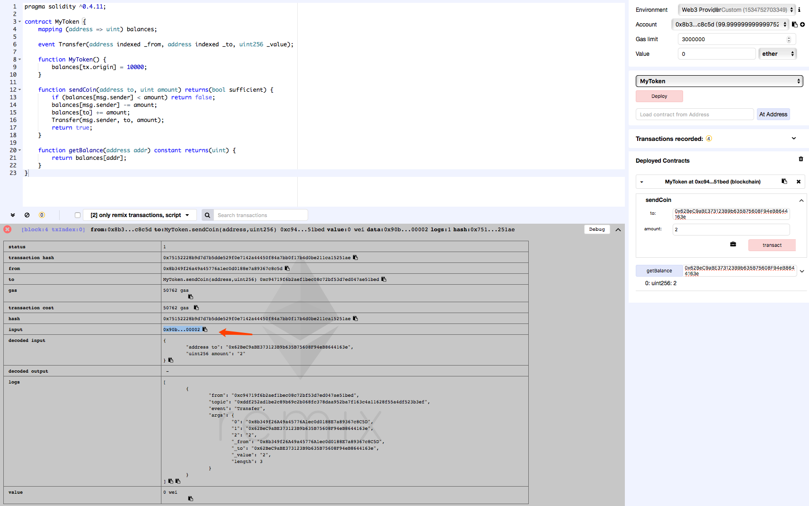
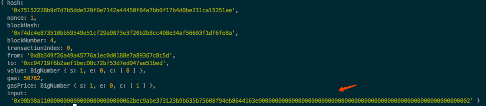

## 0x00 Info

[短地址攻击](https://www.dasp.co/#item-8)是DASP TOP10中详细描述的最后一类漏洞。这个漏洞其实可以归结于过去EVM的缺陷。

<!-- more -->

## 0x01 基础知识


The Contract Application Binary Interface (ABI) is the standard way to interact with contracts in the Ethereum ecosystem, both from outside the blockchain and for contract-to-contract interaction. 


在EVM虚拟机中合约是通过ABI接口进行交互，数据和方法都根据特定标准进行编解码。具体参见[Contract ABI Specification](https://solidity.readthedocs.io/en/develop/abi-spec.html)。

如何通过ABI调用合约方法？方法和数据如何编码？我们举例（经典Token合约）来说明：
```solidity
contract MyToken {
    mapping (address => uint) balances;
 
    event Transfer(address indexed _from, address indexed _to, uint256 _value);
 
    function MyToken() {
        balances[tx.origin] = 10000;
    }
 
    function sendCoin(address to, uint amount) returns(bool sufficient) {
        if (balances[msg.sender] < amount) return false;
        balances[msg.sender] -= amount;
        balances[to] += amount;
        Transfer(msg.sender, to, amount);
        return true;
    }
 
    function getBalance(address addr) constant returns(uint) {
        return balances[addr];
    }
}
```

如果我们想转币到其他地址，会外部调用sendCoin()方法，则创建交易后查看input数据如下：

展开为：


* `0x90b98a11`  方法签名的hash值，4个字节，通过Keccak(sendCoin(address, uint))计算得到
* `00000000000000000000000062bec9abe373123b9b635b75608f94eb8644163e`  'to'地址，20个字节，填充前导0（12字节）至32字节
* `0000000000000000000000000000000000000000000000000000000000000002`  'amount'数量，1字节无符号整型，填充前导0（31字节）至32字节

input就是一笔完整的交易数据。

## 0x02 攻击利用

17年Golem团队发现一笔[可疑的GNT交易](https://etherscan.io/tx/0x0213fb70e8174c5cbd9233a8e95905462cd7f1b498c12ff5e8ec071f4cc99347)，从而发现了短地址漏洞。[How to Find $10M Just by Reading the Blockchain](https://blog.golemproject.net/how-to-find-10m-by-just-reading-blockchain-6ae9d39fcd95)一文中详细描述了漏洞的发现和利用。

我们还是以上面的例子分析下漏洞成因。


EVM和合约如果未校验用户输入会产生什么效果？


我们把'to'地址的32字节最后1字节去掉，变成`0x62bec9abe373123b9b635b75608f94eb864416`，那此时input数据就会变成：
```
0x90b98a11
00000000000000000000000062bec9abe373123b9b635b75608f94eb86441600
00000000000000000000000000000000000000000000000000000000000002
```
第一个参数不足32字节会从第二参数高位取0补位，这样第二个参数就被左移1字节，相当于`amount * 256`。

交易瞬间变成了:
```
 from: '0x8b349f26a49a45776a1ec0d0188e7a89367c8c5d',
   to: '0x62bec9abe373123b9b635b75608f94eb86441600',
value: 512,
```

该漏洞能够成功利用的大前提是：
1. 币充足
2. 在构成input数据时用户的输入和填充没有进行校验（在remix中实验失败就是因为已经不允许传入非法短地址了）


