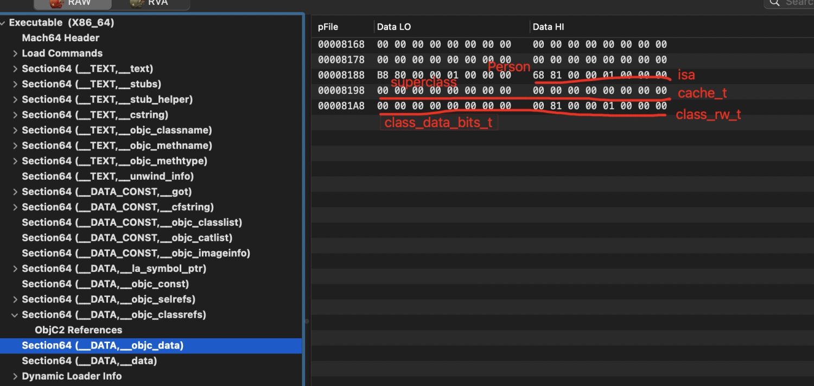
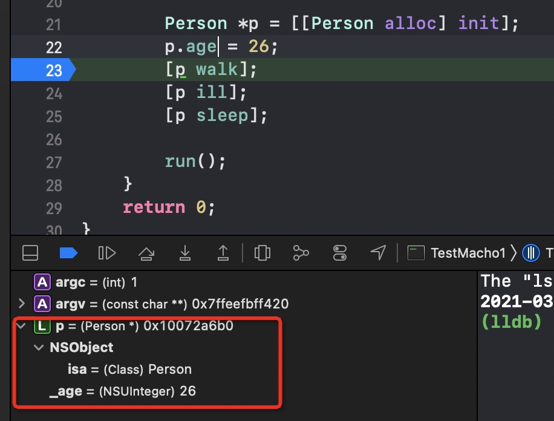

>  iOS AOP文章系列
>
>  前导知识：
>  * [Mach-O文件结构分析](https://houugen.fun/posts/mach-o%E6%96%87%E4%BB%B6%E7%BB%93%E6%9E%84%E5%88%86%E6%9E%90.html)
>  * [静态链接&动态链接](https://houugen.fun/posts/%E9%9D%99%E6%80%81%E9%93%BE%E6%8E%A5%E5%8A%A8%E6%80%81%E9%93%BE%E6%8E%A5.html)
>  * [OC方法&OC类&OC对象](https://houugen.fun/posts/oc%E6%96%B9%E6%B3%95oc%E7%B1%BBoc%E5%AF%B9%E8%B1%A1.html)
>  * 方法查找和消息转发
>
>  AOP框架：
>  * Method Swizzling
>  * Fishhook
>  * Apsects
>  * NSProxy AOP


**源码分析环境：objc4-818.2**


## OC方法

通过之前的文章 [Mach-O文件结构分析](https://houugen.fun/posts/mach-o%E6%96%87%E4%BB%B6%E7%BB%93%E6%9E%84%E5%88%86%E6%9E%90.html) 我们得知OC方法在编译时调用了 `objc_msgSend` 函数

```objective-c
int main(int argc, const char * argv[]) {
    @autoreleasepool {
        // insert code here...
        NSLog(@"Hello, World!");
        
        Person *p = [[Person alloc] init];
        [p walk];
        [p ill];
        [p sleep];
        
        run();
    }
    return 0;
}
```

`clang -rewrite-objc main.m -o main.cpp`

```cpp
int main(int argc, const char * argv[]) {
    /* @autoreleasepool */ { __AtAutoreleasePool __autoreleasepool; 

        NSLog((NSString *)&__NSConstantStringImpl__var_folders_16_fnqk_6_50_z264j18b83nb9w0000gp_T_main_c8b264_mi_1);

        Person *p = ((Person *(*)(id, SEL))(void *)objc_msgSend)((id)((Person *(*)(id, SEL))(void *)objc_msgSend)((id)objc_getClass("Person"), sel_registerName("alloc")), sel_registerName("init"));
        ((void (*)(id, SEL))(void *)objc_msgSend)((id)p, sel_registerName("walk"));
        ((void (*)(id, SEL))(void *)objc_msgSend)((id)p, sel_registerName("ill"));
        ((void (*)(id, SEL))(void *)objc_msgSend)((id)p, sel_registerName("sleep"));

        run();
    }
    return 0;
}
```

`obj_msgSend` 函数有两个参数 `id`、`SEL`，`id` 是操作对象，`SEL` 则通过消息发送机制查找对应 `imp`。

因此OC方法本质就是调用 `obj_msgSend` 函数。

关于 `obj_msgSend` 的消息查找和消息发送在后续文章中详细介绍。

## OC类/OC对象

`Person *p = [[Person alloc] init];`

我们在 `main.cpp` 文件以及源码中看下 `Person` 类（class）和 `p` 对象（id）的结构体

```cpp
// main.cpp
struct Person_IMPL {
    struct NSObject_IMPL NSObject_IVARS;
};

struct NSObject_IMPL {
    Class isa;
};

typedef struct objc_class *Class;
typedef struct objc_object *id;

// objc-runtime-new.h
struct objc_class : objc_object {
    // Class ISA;
    Class superclass;
    cache_t cache;             // formerly cache pointer and vtable
    class_data_bits_t bits;    // class_rw_t * plus custom rr/alloc flags
    class_rw_t *data() const {
        return bits.data();
    }
    ...
 }

// objc-private.h
struct objc_object {
private:
    isa_t isa;
public:
    // ISA() assumes this is NOT a tagged pointer object
    Class ISA(bool authenticated = false);
    // rawISA() assumes this is NOT a tagged pointer object or a non pointer ISA
    Class rawISA();
    // getIsa() allows this to be a tagged pointer object
    Class getIsa();
    ...
 }
```

`Person` 类是一个 `objc_class` 结构体，而 `objc_class` 继承自 `objc_object`，说明类本身也是一个对象，称之为类对象。

类包含:

- `isa`  // 为了内存优化，设计成 `isa_t` 结构体，指向元类
- `superclass` // 父类指针
- `cache` // 该类的方法缓存
- `bits` // 该类的具体信息
- `data` // 存放类的方法、属性、协议等信息

首先看下 `cache_t` 结构体，主要作为存储方法缓存，具体原理我们在**方法缓存查找**文章中讲解：

```c
struct cache_t {
    ...
public:
    mask_t mask() const; // 缓存数组的容量临界值
    struct bucket_t *buckets() const;  // 方法缓存数组
    Class cls() const;
    mask_t occupied() const; // 缓存数组中已缓存方法数量
    ...
}

struct bucket_t {
private:
#if __arm64__
    explicit_atomic<uintptr_t> _imp;
    explicit_atomic<SEL> _sel;
#else
    explicit_atomic<SEL> _sel;
    explicit_atomic<uintptr_t> _imp;
#endif
    ...
}
```

再看下 `class_data_bits_t` 结构体：

```c
struct class_data_bits_t {
    friend objc_class;
    // Values are the FAST_ flags above.
    uintptr_t bits;
    ...
public:
    class_rw_t* data() const {
        return (class_rw_t *)(bits & FAST_DATA_MASK);
    }
    ...
}

struct class_rw_t {
    // Be warned that Symbolication knows the layout of this structure.
    uint32_t flags;
    uint16_t witness;
#if SUPPORT_INDEXED_ISA
    uint16_t index;
#endif
    explicit_atomic<uintptr_t> ro_or_rw_ext;
    Class firstSubclass;
    Class nextSiblingClass;
    ...
public:
    ...
    const method_array_t methods() const {
        auto v = get_ro_or_rwe();
        if (v.is<class_rw_ext_t *>()) {
            return v.get<class_rw_ext_t *>(&ro_or_rw_ext)->methods;
        } else {
            return method_array_t{v.get<const class_ro_t *>(&ro_or_rw_ext)->baseMethods()};
        }
    }

    const property_array_t properties() const {
        auto v = get_ro_or_rwe();
        if (v.is<class_rw_ext_t *>()) {
            return v.get<class_rw_ext_t *>(&ro_or_rw_ext)->properties;
        } else {
            return property_array_t{v.get<const class_ro_t *>(&ro_or_rw_ext)->baseProperties};
        }
    }

    const protocol_array_t protocols() const {
        auto v = get_ro_or_rwe();
        if (v.is<class_rw_ext_t *>()) {
            return v.get<class_rw_ext_t *>(&ro_or_rw_ext)->protocols;
        } else {
            return protocol_array_t{v.get<const class_ro_t *>(&ro_or_rw_ext)->baseProtocols};
        }
    }
};
```

其中即存放着方法列表、属性列表、协议列表等


需要注意类存放对象方法，元类存放类方法


现在我们回头看下[Mach-O文件结构分析](https://houugen.fun/posts/mach-o%E6%96%87%E4%BB%B6%E7%BB%93%E6%9E%84%E5%88%86%E6%9E%90.html)中介绍的 `Section64(__DATA,__objc_data)` 分布，存储的是 `objc_calss` 类结构，是不是一目了然：



而存储与`Section64(__DATA,__objc_const)` 的 `class_rw_t` 结构体分布也得以验证。

## 元类（metaclass）

既然类也是一个对象，那么它一定是其他类的实例，那个类就是元类 (`metaclass`)。元类是类（对象）的描述，就像类是普通实例的描述一样。特别的是，元类的方法列表是类方法。当你发送消息给一个类，`objc_msgSend` 会查找元类（已及它的父类）的方法列表并确定调用的方法。

可以从创建类的过程来了解下元类，我们为 `Person` 添加一个子类 `Student`：

```objective-c
void StudyFunction(id self, SEL _cmd)
{
    NSLog(@"i am studing");
}

int main(int argc, const char * argv[]) {
    
    @autoreleasepool {
        Person *p = [[Person alloc] init];
        p.age = 26;
        [p walk];
        [p sleep];
        
        run();
        
        // 为class pair分配内存
        Class newClass = objc_allocateClassPair([Person class], "Student", 0);
        // 为新类添加方法
        class_addMethod(newClass, @selector(study), (IMP)StudyFunction, "v@:");
        // 注册类
        objc_registerClassPair(newClass);
        // 初始化实例对象
        id s = [[newClass alloc] init];
        // 调用本类 study 方法
        [s performSelector:@selector(study)];
        // 调用父类 sleep 方法
        [s sleep];
    }
    return 0;
}
```

`Student` 实例对象调用 `Person` 类方法，会查找自己的类和父类的方法列表：



我们看一下 `objc_allocateClassPair` 源码：

```c
Class objc_initializeClassPair(Class superclass, const char *name, Class cls, Class meta)
{
    // Fail if the class name is in use.
    if (look_up_class(name, NO, NO)) return nil;

    mutex_locker_t lock(runtimeLock);

    // Fail if the class name is in use.
    // Fail if the superclass isn't kosher.
    if (getClassExceptSomeSwift(name)  ||
        !verifySuperclass(superclass, true/*rootOK*/))
    {
        return nil;
    }

    objc_initializeClassPair_internal(superclass, name, cls, meta);

    return cls;
}

static void objc_initializeClassPair_internal(Class superclass, const char *name, Class cls, Class meta)
{
    ...
    class_ro_t *cls_ro_w, *meta_ro_w;
    class_rw_t *cls_rw_w, *meta_rw_w;
    
    cls_rw_w   = objc::zalloc<class_rw_t>();
    meta_rw_w  = objc::zalloc<class_rw_t>();
    cls_ro_w   = (class_ro_t *)calloc(sizeof(class_ro_t), 1);
    meta_ro_w  = (class_ro_t *)calloc(sizeof(class_ro_t), 1);

    ...

    // Set basic info
    ...

    // Connect to superclasses and metaclasses
    cls->initClassIsa(meta);  // 0

    if (superclass) {
        meta->initClassIsa(superclass->ISA()->ISA()); // 1
        cls->setSuperclass(superclass); // 2
        meta->setSuperclass(superclass->ISA()); // 3
        addSubclass(superclass, cls); // 4
        addSubclass(superclass->ISA(), meta); // 5
    } else {
        meta->initClassIsa(meta);
        cls->setSuperclass(Nil);
        meta->setSuperclass(cls);
        addRootClass(cls);
        addSubclass(cls, meta);
    }

    addClassTableEntry(cls);
}
```

在 `objc_initializeClassPair_internal` 中分配了 `class_ro_t` / `class_rw_t` 类结构体，设置类 `flag` 等类基础信息，最后实现类 `superclass` 和 `isa` 的指向。可以用下图来展示链接过程：



## isa指针

通过前面分析，每一个对象都以一个 `isa` 指针，实际上 `isa` 就是将对象 , 类 , 以及元类连接起来，在实例对象中指向类对象，类对象的 `isa` 指向元类，元类的 `isa` 指向根元类，根元类指向自己。

至于 `isa` 的优化不做过多介绍，读者可自行查阅学习。

## 实例对象

给 `Person` 类增加一个 `age` 属性，`debug` 查看 `p` 实例对象，**发现实例对象只拷贝了类的成员变量，而没有类定义的方法。**


