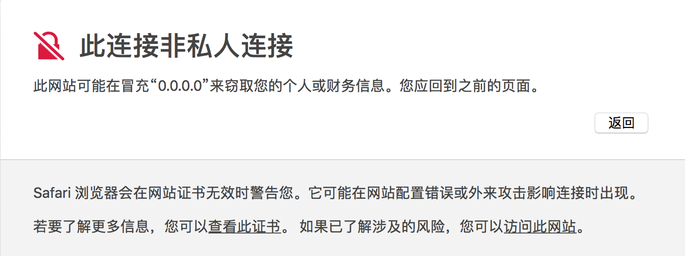
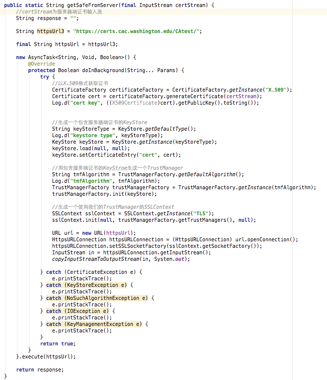
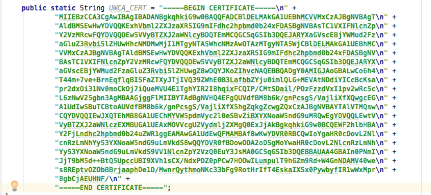

## 0x00 目的

通过使用HttpClinet、HttpURLConnect、Volley、Okhttp、Retrofit及Webview，快速识别android网络请求框架为了能定位关键代码，完全理解不正确及正确的证书、域名及sslpinning校验过程。

<!-- more -->

## 0x01 HttpClient & HttpURLConnection

### 发送请求

android 6.0 删除HttpClient类库，仍需使用的方法：

-   eclipse：libs中加入org.apache.http.legacy.jar
-   AS：在build.gradle中加入

<!-- -->

        android {
            useLibrary 'org.apache.http.legacy'
          }

**使用HttpClient发送Http GET请求**

``` java
HttpClient mHttpClient = new DefaultHttpClient();
HttpGet mHttpGet = new HttpGet(url);
HttpResponse mHttpResponse = mHttpClient.execute(mHttpGet);
HttpEntity mHttpEntity = mHttpResponse.getEntity();
```

> DefaultHttpClient with default constructor is not compatible with TLS 1.2 建议使用SystemDefaultHttpClient代替： 
>
> ```java
> HttpClient client = new SystemDefaultHttpClient(); 
> or HttpClient client = HttpClientBuilder.create().useSystemProperties().build();
> ```

**使用HttpURLConnection发送Http GET请求**

``` java
URL url = new URL(url);
HttpURLConnection urlConnection = (HttpURLConnection)url.openConnection();
InputStream mInputStream = mHttpURLConnection.getInputStream();
```

以上代码均能自动处理HTTP和HTTPS请求。
在调用URL的openConnection()方法时，如果URL是HTTP协议的，返回的是一个HttpURLConnection对象，而如果URL是HTTPS协议的，返回的将是一个HttpsURLConnection对象。

### 使用代理

HttpClient使用代理

``` java
HttpHost proxy = new HttpHost("127.0.0.1", 9876, "HTTP");
HttpParams httpParams = new BasicHttpParams();
httpParams.setParameter(ConnRouteParams.DEFAULT_PROXY, proxy);
HttpClient mHttpClient = new DefaultHttpClient(httpParams);
HttpGet mHttpGet = new HttpGet(url);
HttpResponse mHttpResponse = mHttpClient.execute(mHttpGet);
```

HttpURLConnection使用代理

``` java
Proxy proxy = new Proxy(Proxy.Type.HTTP, new InetSocketAddress("127.0.0.1", 9876));
URL mUrl = new URL(url);
HttpURLConnection con = (HttpURLConnection) mUrl.openConnection(proxy);
```

> HttpClient 不支持 SOCKS 
> HttpURLConnectino 支持 Proxy.Type.SOCKS

使用系统代理

``` java
Properties props = System.getProperties();
props.setProperty("proxySet", "true");
props.setProperty("http.proxyHost", host);
props.setProperty("http.proxyPort", port); 
```

> 代理https请求：https.proxyHost/Port 代理socks请求：socksProxyHost/Port

### https和证书

上面展示了用HttpClient及HttpURLConnect API访问https网站。

**特点**：由Android系统校验服务端数字证书的合法性，用可信CA签发的数字证书的网站才可以正常访问，私有CA签发的数字证书的网站无法访问。

  <br> *私有CA签发的证书网站如何访问？*


可以看出如果要进行 SSL 会话，必须得新建一个 SSLSocket 对象，而 SSLSocket对象是通过 SSLSocketFactory 来管理的，SSLSocketFactory对象则依赖于SSLContext ，SSLContext 对象又依赖于 keyManager、TrustManager 和SecureRandom。我们这里最关心的是 TrustManager 对象，正是 TrustManager负责证书的校验。 
> android Xiaomi MAX证书路径: /system/etc/security/cacerts

<br> **准备工作**

**1. 生成自签证书**

1.  生成自己的CA根证书

    * 生成CA私钥文件ca.key：` openssl genrsa -out ca.key 1024`
    * 生成X.509证书签名请求文件ca.csr：` openssl req -new -key
      ca\_private.key -out ca.csr`
      在生成ca.csr的过程中，会让输入一些组织信息等。
  	* 生成X.509格式的CA根证书ca\_public.crt（公钥证书）： `openssl x509
      -req -in ca.csr -signkey ca\_private.key -out ca\_public.crt`

2.  生成服务器证书
		
    * 先生成服务器私钥文件server\_private.key： `openssl genrsa -out server\_private.key 1024`
    * 根据服务器私钥生成服务器公钥文件server\_public.pem： `openssl rsa -in server\_private.key -pubout -out server\_public.pem`
    * 服务器端需要向CA机构申请签名证书，在申请签名证书之前依然是创建自己的证书签名请求文件server.csr：`openssl req -new -key server\_private.key -out server.csr`

对于用于HTTPS的CSR，Common Name必须和网站域名一致，以便之后进行HostName校验。

	* 服务器端用server.csr文件向CA申请证书，签名过程需要CA的公钥证书和私钥参与，最终颁发一个带有CA签名的服务器端证书server.crt：`openssl x509 -req -CA ca\_public.crt -CAkey ca\_private.key -CAcreateserial -in server.csr -out server.crt`

> 使用webpy搭建服务器，代码详见demo（webpytest.py）

**2. 信任所有证书**

``` java
//证书校验
TrustManager[] trustAllCerts = new TrustManager[] {
    new X509TrustManager() {
        @Override
        public void checkClientTrusted(X509Certificate[] x509Certificates, String s) throws CertificateException {
            
        }
        @Override
        public void checkServerTrusted(X509Certificate[] x509Certificates, String s) throws CertificateException {
        }
        @Override
        public X509Certificate[] getAcceptedIssuers() {
            return new X509Certificate[0];
        }
    }
};
//域名校验
HostnameVerifier hostnameVerifier = new HostnameVerifier() {
    @Override
    public boolean verify(String s, SSLSession sslSession) {
        return true;
    }
};

SSLContext mSSLContext = SSLContext.getInstance("TLS");
mSSLContext.init(null, trustAllCerts, new SecureRandom());
URL mUrl = new URL(url);
//HttpsURLConnection.setDefaultSSLSocketFactory(mSSLContext.getSocketFactory());
//HttpsURLConnection.setDefaultHostnameVerifier(hostnameVerifier);
HttpsURLConnection httpsURLConnection = (HttpsURLConnection) mUrl.openConnection();
httpsURLConnection.setSSLSocketFactory(mSSLContext.getSocketFactory());
httpsURLConnection.setHostnameVerifier(hostnameVerifier);
```

**3. 正确的证书校验**

正确实现checkServerTrusted函数：

``` java
public final void checkServerTrusted(X509Certificate[] x509CertificateArr, String str) {
    if (x509CertificateArr == null) {
        throw new IllegalArgumentException("check server x509Certificates is null");
    }
    if (x509CertificateArr.length < 0) {
        throw new IllegalArgumentException("check server x509Certificates is empty");
    }
    for (X509Certificate cert : x509CertificateArr) {
        try {
            cert.checkValidity();
            String cername = "server1.crt";
            InputStream is = new BufferedInputStream(context.getAssets().open(cername));
            CertificateFactory certificateFactory = CertificateFactory.getInstance("X.509");
            X509Certificate serverCert = (X509Certificate)certificateFactory.generateCertificate(is);
            cert.verify(serverCert.getPublicKey());
        } catch (Exception e e) {
            e.printStackTrace();
        }
    }
}
```

正确实现域名校验verify函数：

``` java
public final boolean verify(String str, SSLSession sSLSession) {
    HostnameVerifier hv = HttpsURLConnection.getDefaultHostnameVerifier();
    Boolean result = hv.verify("*.xxx.com", sSLSession);
    return result;
}
```

以上代码为简单实现，还可以从session获取服务器域名与本地证书解析后的域名做比对。

**4. SSL Pinning**

直接用预埋的证书来生成TrustManger



参数certStream是证书文件的InputSteam流


另外可以用以下命令查看服务器证书的公钥：

`keytool -printcert -rfc -file uwca.crt`

直接复制粘贴可以将公钥信息硬编码在代码中



可以用以下形式获取此公钥对应的X.509证书：


## 0x02 Volley

在2013年Google I/O大会上推出了一个新的网络通信框架Volley。 

Volley is an HTTP library that makes networking for Android apps easier and, most importantly, faster.

[github](https://github.com/google/volley)

[Android developer training
page](https://developer.android.com/training/volley/index.html)

> android版本大于等于2.3则调用基于HttpURLConnection的HurlStack，否则就调用基于HttpClient的HttpClientStack。
> 

### volley POST请求


### Volley + 自定义证书

[h修改volley源码（volley.java）](https://www.jianshu.com/p/0e1b683e6108)

原理和上面讲的一致：
读取证书加载到keyStore，创建TrustManagerFactory对象tmf用keyStore初始化，再创建SSLContext对象用tmf初始化，即可以用SSLContext得到SSLSocketFactory进行自签名证书的网络请求。

## 0x03 OkHttp

### 发送请求

官方事例：

``` java
OkHttpClient client = new OkHttpClient();

String post(String url, String json) throws IOException {
  RequestBody body = RequestBody.create(JSON, json);
  Request request = new Request.Builder()
      .url(url)
      .post(body)
      .build();
  Response response = client.newCall(request).execute();
  return response.body().string();
}
```

异步POST请求

``` java
OkHttpClient client = new OkHttpClient();
RequestBody formBody = new FormBody.Builder()
             .add("aaa", "bbb")
             .build();
Request request = new Request.Builder()
        .url(url)
        .post(formBody)
        .build();
client.newCall(request).enqueue(new Callback() {
    @Override
    public void onFailure(Call call, IOException e) {
    }
    @Override
    public void onResponse(Call call, Response response) throws IOException {
        return response.body().string();
    }
});
```

> 实例参见阿里TV助手应用

### 设置代理

``` java
OkHttpClient client = new OkHttpClient.Builder().proxy(new Proxy(Proxy.Type.HTTP, new InetSocketAddress("112.95.91.101", 9999))).build();
```

[给OkHttp Client添加socks代理](https://zhuanlan.zhihu.com/p/33725556)

### 自签名证书

未校验服务器端证书链、未校验服务端证书域名（信任所有证书及域名）：

``` java
// wrong checkServerTrusted & HostnameVerifier
TrustManager[] trustAllCerts = new TrustManager[] {
        new X509TrustManager() {
            @Override
            public void checkClientTrusted(X509Certificate[] x509Certificates, String s) throws CertificateException {

            }

            @Override
            public void checkServerTrusted(X509Certificate[] x509Certificates, String s) throws CertificateException {

            }

            @Override
            public X509Certificate[] getAcceptedIssuers() {
                return new X509Certificate[0];
            }
        }
};
HostnameVerifier hostnameVerifier = new HostnameVerifier() {
    @Override
    public boolean verify(String s, SSLSession sslSession) {
        return true;
    }
};

try {
    SSLContext sslContext = SSLContext.getInstance("TLS");
    sslContext.init(null, trustAllCerts, new SecureRandom());

    OkHttpClient mOkHttpClient = new OkHttpClient.Builder().hostnameVerifier(hostnameVerifier)
            .sslSocketFactory(sslContext.getSocketFactory()).build();
    okhttp3.Request request = new okhttp3.Request.Builder().url(url).build();
    mOkHttpClient.newCall(request).enqueue(new Callback() {
        @Override
        public void onFailure(Call call, IOException e) {

        }

        @Override
        public void onResponse(Call call, okhttp3.Response response) throws IOException {
            String body = response.body().string();
            Log.i("lzm", "network---" + body);
        }
    });
} catch (NoSuchAlgorithmException e) {
    e.printStackTrace();
} catch (KeyManagementException e) {
    e.printStackTrace();
}
```

正确实现同上，需真正实现 checkServerTrusted 和 verify 函数。详见demo。

### SSL Pinning

``` java
OkHttpClient client = new OkHttpClient.Builder()
    .certificatePinner(new CertificatePinner.Builder()
        .add("publicobject.com", "sha256/afwiKY3RxoMmLkuRW1l7QsPZTJPwDS2pdDROQjXw8ig=")
        .build())
    .build();
```

[Certificate
Pinning](https://github.com/square/okhttp/blob/master/samples/guide/src/main/java/okhttp3/recipes/CertificatePinning.java)

获取本地证书

``` java
public static CertificatePinner getCertificata() {
    Certificate ca = null;
    try {
        CertificateFactory cf = CertificateFactory.getInstance("X.509");
        InputStream caInput = ZMApplication.getZMContext().getResources().openRawResource(R.raw.test);
    try {
            ca = cf.generateCertificate(caInput);
        } finally {
            caInput.close();
        }
    } catch (CertificateException | IOException e) {
        e.printStackTrace();
    }
    String certPin = "";
    if (ca != null) {
        certPin = CertificatePinner.pin(ca);
    }
    CertificatePinner certificatePinner = new CertificatePinner.Builder()
            .add(UrlConfig.RELEASE_BASE_URL, certPin)
            .build();

    return certificatePinner;
}
```

## 0x04 Retrofit

Retrofit是Square公司开发的一款针对Android网络请求的框架，Retrofit2底层基于OkHttp实现

<http://square.github.io/retrofit/>

[examples](https://github.com/square/retrofit/tree/master/samples/src/main/java/com/example/retrofit)

### 发送请求

``` java
// 创建接口
public interface HtmlService {
    @GET("/")
    Call<String> doIndex();

    @FormUrlEncoded
    @POST("/login")
    Call<String> doLogin(@Field("username")String name, @Field("password") String password);
}
```

``` java
// 1. 构建Retrofit对象，addConverterFactory是对response进行解析
Retrofit retrofit = new Retrofit.Builder()
        .addConverterFactory(ScalarsConverterFactory.create())
        .baseUrl(url)
        .build();
// 2. 动态代理生成接口对象
HtmlService htmlService = retrofit.create(HtmlService.class);
// 3. 通过接口的方法得到调用的对象
// Call<String> call = htmlService.doIndex(); //GET
Call<String> call = htmlService.doLogin("admin", "admin"); //POST
// 4. 异步方法得到response
call.enqueue(new Callback<String>() {
    @Override
    public void onResponse(Call<String> call, retrofit2.Response<String> response) {
        Log.i("lzm", response.body());
    }
    @Override
    public void onFailure(Call<String> call, Throwable throwable) {
        Log.i("lzm", throwable.getMessage());
    }
});
```

> 使用webpy搭建服务器，代码详见demo（webpytest2.py）
> 实例参见咪咕TV（miguTV\_3.3.0.apk）

### 自签名证书

Retrofit+OkHttp进行证书校验，而OkHttp证书校验上文已经介绍。

``` java
OkHttpClient client = new OkHttpClient.Builder()  
     .sslSocketFactory(HTTPSUtils.getSSLSocketFactory(context)) 
     .hostnameVerifier(HTTPSUtils.getHostNameVerifier(hostUrls))
     .build();
Retrofit retrofit = new Retrofit.Builder().baseUrl(baseUrl) 
     .client(client) 
     .build();
```

## 0x05 WebView

### 发送请求

通过Intent启动webview

``` java
Uri uri = Uri.parse(url);  
Intent intent = new Intent(Intent.ACTION_VIEW,uri);  
startActivity(intent);  
```

创建布局

``` java
<WebView  
        android:id="@+id/webView"  
        android:layout_width="match_parent"  
        android:layout_height="wrap_content">  
</WebView>
```

使用webview加载页面

``` java
webView = (WebView) findViewById(R.id.webView1);      webView.getSettings().setAllowUniversalAccessFromFileURLs(true);
String url = getIntent().getData().toString();
webView.loadUrl(url);
webView.setWebViewClient(new WebViewClient());
```

### 自签名证书

ca 认证的证书，在 WebView 则可以直接显示出来，不需要特殊处理。
服务端采用的是可信CA颁发的证书，需要在webView.setWebViewClient(webviewClient)时重载WebViewClient的onReceivedSslError()。

错误的做法：

``` java
@Override
public void onReceivedSslError(WebView view, SslErrorHandler handler, SslError error) {
    handler.proceed();
}
```

正确写法：

1.安全级别较低的方案：证书出现问题，可以提示用户风险，让用户选择加载与否

``` java
webView.setWebViewClient(new WebViewClient() {
    @Override
    public void onReceivedSslError(WebView view, final SslErrorHandler handler, SslError error) {
        final AlertDialog.Builder builder = new AlertDialog.Builder(WebviewActivity.this);
        SslCertificate sslCertificate = error.getCertificate();

        switch (error.getPrimaryError()) {
            case SslError.SSL_DATE_INVALID:
                Log.i("lzm", SslError.SSL_DATE_INVALID + " ssl date invalid");
                break;
            case SslError.SSL_IDMISMATCH:
                Log.i("lzm", SslError.SSL_IDMISMATCH + " hostname dismatch");
                break;
            case SslError.SSL_EXPIRED:
                Log.i("lzm", SslError.SSL_EXPIRED + " cert has expired");
                break;
            case SslError.SSL_UNTRUSTED:
                Log.i("lzm", SslError.SSL_UNTRUSTED + " cert is not trusted");
                break;
            case SslError.SSL_INVALID:
                Log.i("lzm", SslError.SSL_INVALID + " cert is invalid");
                break;
            case SslError.SSL_NOTYETVALID:
                Log.i("lzm", SslError.SSL_NOTYETVALID + " cert is not yet valid");
                break;
        }

        builder.setTitle("ssl error");
        builder.setMessage("ssl error code: " + error.getPrimaryError());
        builder.setPositiveButton("proceed", new DialogInterface.OnClickListener() {
            @Override
            public void onClick(DialogInterface dialogInterface, int i) {
                handler.proceed();
            }
        });
        builder.setNegativeButton("cancel", new DialogInterface.OnClickListener() {
            @Override
            public void onClick(DialogInterface dialogInterface, int i) {
                handler.cancel();
            }
        });
        final AlertDialog dialog = builder.create();
        dialog.show();
    }
});
```

2.安全的方案是当出现了证书问题的时候，读取本地保存的的根证书，然后与服务器校验，通过则继续执行
handler.proceed()，否则执行 handler.cancel()。

``` java
webView.setWebViewClient(new WebViewClient() {
        @Override
        public void onReceivedSslError(WebView view, final SslErrorHandler handler, SslError error) {
            checkCAweb(handler, view.getUrl());
        }
    });

private void checkCAweb(final SslErrorHandler handler, String url) {
    OkHttpClient.Builder builder = setCer(new OkHttpClient.Builder());
    Request request = new Request.Builder().url(url).build();
    builder.build().newCall(request).enqueue(new Callback() {
        @Override
        public void onFailure(Call call, IOException e) {
            Log.i("lzmtest", e.getMessage());
            handler.cancel();
        }

        @Override
        public void onResponse(Call call, Response response) throws IOException {
            Log.i("lzmtest", response.body().string());
            handler.proceed();
        }
    });
}

private OkHttpClient.Builder setCer(OkHttpClient.Builder client) {
    try {
        SSLContext sslContext = SSLContext.getInstance("TLS");
        // 正确实现服务器证书校验 trustCert，见上文
        sslContext.init(null, trustCert, new SecureRandom());
        client.sslSocketFactory(sslContext.getSocketFactory());
        // 正确实现域名校验 verify，见上文
        client.hostnameVerifier(new MyHostnameVerifier());
    } catch (Exception e) {
        e.printStackTrace();
    }
    return client;
}
```

> 具体程序见demo (webviewtest.apk)

### SSL Pinning

[Android-SSL-Pinning-WebViews](https://github.com/menjoo/Android-SSL-Pinning-WebViews)

基本实现和上文保持一致：初始化keyStore，将可信证书（本地or硬编码）加入keyStore，在TrustManagerFactory中初始化keyStore，设置SSLcontext，用TrustManager初始化。使用网络请求框架（HttpURLConnect，OkHttp等）设置SocketFactory，setSSLSocketFactory(sslContext.getSocketFactory())。

## 0x06 小结

建议开发或对https方面不了解的安全测试同学查看android开发指南之[通过HTTPS 和 SSL确保安全](https://developer.android.com/training/articles/security-ssl.html)。
正确实现https也可通过Hook方式绕过，android下常用的有Xposed工具：

-   JustTrustMe
-   SSLUnpinning

及Frida工具：

-   [objection](https://github.com/sensepost/objection)
-   [frida-android-repinning](https://codeshare.frida.re/@pcipolloni/universal-android-ssl-pinning-bypass-with-frida/)

想保证通信安全，敏感信息还应该做二次加密，接口做签名，客户端本身防Hook等。

## 参考

[1][https://developer.android.com/training/articles/security-ssl.html](https://developer.android.com/training/articles/security-ssl.html)

[2][https://www.cnblogs.com/liyiran/p/7011317.html](https://www.cnblogs.com/liyiran/p/7011317.html)

[3][https://jaq.alibaba.com/community/art/show?articleid=545](https://jaq.alibaba.com/community/art/show?articleid=545)

[4][http://liuwangshu.cn/tags/Android%E7%BD%91%E7%BB%9C%E7%BC%96%E7%A8%8B/](http://liuwangshu.cn/tags/Android%E7%BD%91%E7%BB%9C%E7%BC%96%E7%A8%8B/)

[5][https://blog.csdn.net/sbsujjbcy/article/details/45568053](https://blog.csdn.net/sbsujjbcy/article/details/45568053)

[6][http://find-sec-bugs.github.io/bugs.htm](http://find-sec-bugs.github.io/bugs.htm)

[7][https://blog.it-securityguard.com/the-stony-path-of-android-%F0%9F%A4%96-bug-bounty-bypassing-certificate-pinning/](https://blog.it-securityguard.com/the-stony-path-of-android-%F0%9F%A4%96-bug-bounty-bypassing-certificate-pinning/)