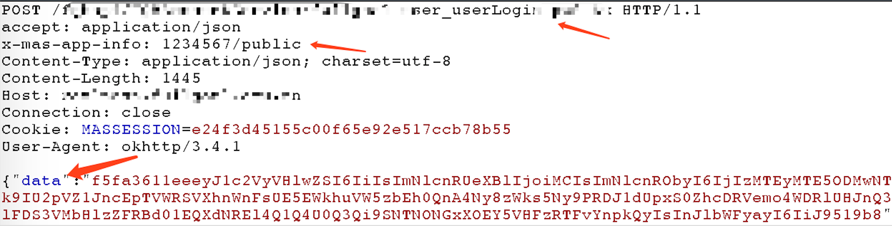
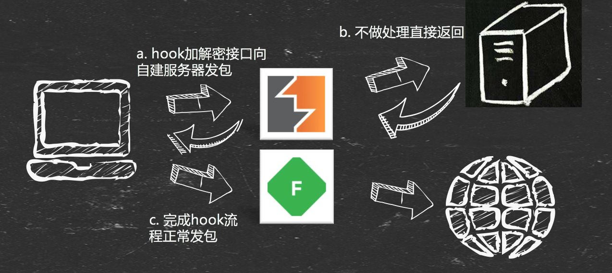
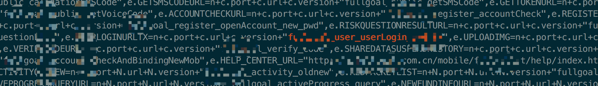
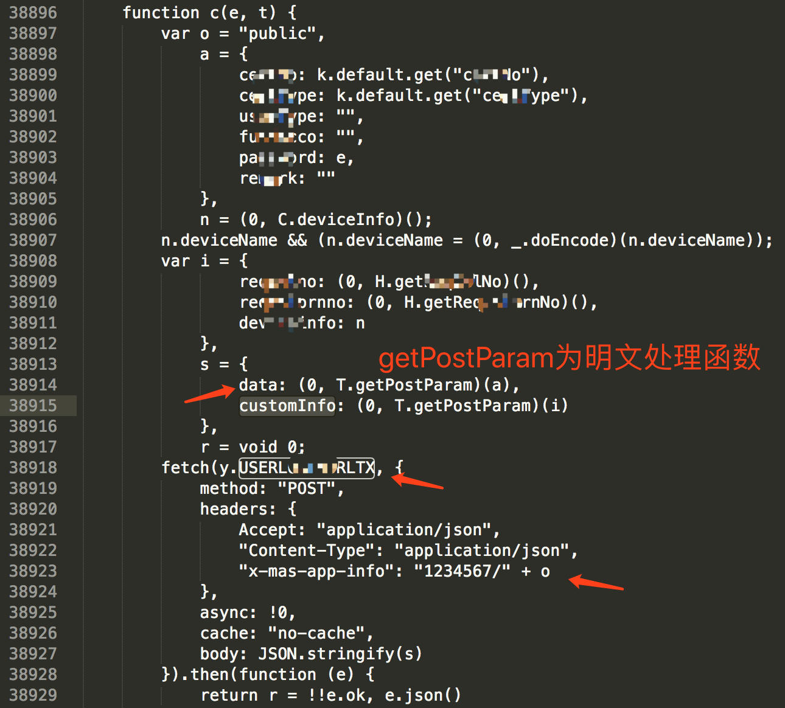
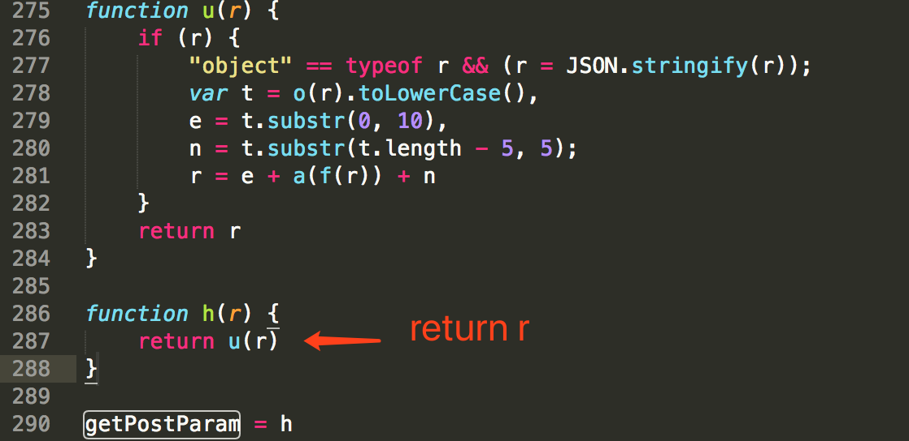
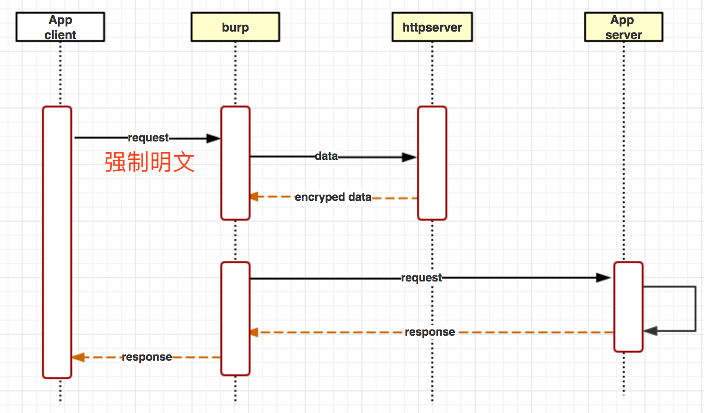
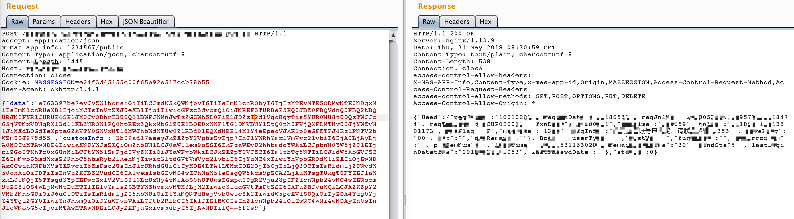
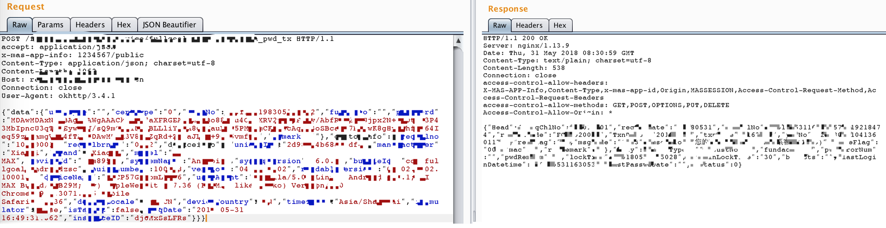

## 0x00 背景

最近在做测试时发现应用使用 facebook 的 react-native 进行混合开发，对于想了解 react-native 的同学，可以查阅[github](https://github.com/facebook/react-native)和[官方文档](http://facebook.github.io/react-native/docs/getting-started.html)，网上也有很多 android 内嵌 react-native 进行混合开发的环境搭建及教程供学习，例如：[https://blog.csdn.net/u011148116/article/details/58178348](https://blog.csdn.net/u011148116/article/details/58178348)。

该应用核心业务接口数据加密，且加密逻辑在本地js中实现，而测试过程有代理明文抓包改参需求，而研究一二，并记录过程。

<!-- more -->

## 0x01 通信加解密历史
终端应用渗透测试包括 客户端<--通信-->服务端，客户端测试可以通过各种逆向反编译、动态调试、hook框架分析逻辑及攻击面，而服务端安全则需要通过中间人的方式抓包改参（人工、漏扫、fuzz）来挖掘服务端漏洞。

而现有的app基本都使用https传输，对数据敏感的应用会做二次加密或格式化序列化处理。针对https的原理和绕过可以参考[android网络请求-证书认证](https://houugen.github.io/2018/05/24/android网络请求-证书认证/)，而对于二次加密，则需要逆向分析客户端代码了。

常见的加解密逻辑都会在java层或native层，通过url、头关键字、请求关键字、加密算法、log等关键字在反编译代码中搜寻定位。



绕过加密手段有:

* hook插件+代理插件的方式
* hook插件+server+代理插件的方式

其核心都是在代理中获取明文数据，而明文加密的操作放在插件中。




## 0x02 react-native js解密
本次测试开始采用通用方式，在反编译代码中搜寻蛛丝马迹，然并卵，本以为请求逻辑做在了native中，简单搜索`System.loadLibrary`也未确定可疑so文件。

故通过解压apk，全局搜索接口关键字：

```bash
grep -rn "xxx" .
```

在 assets 文件下的js文件中发现关键字：




可确定使用js+android混合开发，而网络请求与数据加密均由js实现。

那我们思路就是js强制发明文，经过burp加密发送；或者经过server加密，burp发送加密数据。

ok，思路清晰后，我们就要带着如下问题进行尝试：


1. js中post数据构成逻辑为何？如何强制明文？
2. 两种方式工作量对比，若采用burp加密，是复现js加密算法，还是加载js？若采用server加密，改如何构建c（burp）-s（server）？
3. server我使用擅长的python实现，那如何在python中运行js？


***首先来看第一个问题：***

js文件`index.android.bundle`未做加密和强混淆，通过格式化即可看到代码原貌，通过关键字（箭头所指）确定发送请求和参数构造（图中文字）代码：


而参数经过一系列函数的运算加密生成：


发送明文也很简单，直接修改js代码 `return r` 即可，这里也打消在burp插件中复现js加密逻辑的想法，真的很复杂。


这里因为修改了apk的资源文件，重压缩打包后需要签名，否则安装报错。


***接着看第二个问题：***

直接在burp插件中实现js的运行是否可行，用java需要js解释引擎，感觉上插件体量会比较大而且调试非常不方便。然而用python写插件会有各种异常（不推荐python写burp插件）。

想了一下还是采用server的方式。即在burp插件中实现明文请求拦截，并使用HttpClient发送至python httpserver，server对数据加密回传，burp利用setRequest发送加密后数据进行正常的业务请求。

流程大概如下：


其中burp中使用apache的httpcomponents-client包作为网络请求模块，burp插件处理请求代码：


**注意在编辑器中生成burp所用的jar包时需要将第三方包一起打包，否则会报classnotfound错误，推荐使用fatjar打包方式**


```java
@Override
public void processHttpMessage(int toolFlag, boolean messageIsRequest, IHttpRequestResponse messageInfo) {
	String host = messageInfo.getHttpService().getHost();
	if (host.contains("your_hostname")){
		if(messageIsRequest) {
			byte[] request = messageInfo.getRequest();
			IRequestInfo ireinfo = helpers.analyzeRequest(request);
			List<String> headers = ireinfo.getHeaders();
			int offset = ireinfo.getBodyOffset();
			String body = helpers.bytesToString(request).substring(offset);
			stdout.println("request body--->\n" + body);
			String ret = utls.Request(body);
			stdout.println("python response--->\n" + ret);
			String newbody = "{\"data\":\"" + ret.split(":")[0] + "\",\"customInfo\":\"" + ret.split(":")[1] + "\"}";
			stdout.println("newbody--->\n" + newbody);
			messageInfo.setRequest(helpers.buildHttpMessage(headers, newbody.getBytes()));
		}
	}	
}
```


python httpserver使用HTTPServer模块（py3.x）或BaseHTTPServer模块（py2.x）
```python
class PostHandler(BaseHTTPRequestHandler):
    def _writeheaders(self):
        print(self.path)
        print(self.headers)
        self.send_response(200);
        self.send_header('Content-type','text/html');
        self.end_headers()

    def do_POST(self):
        # Parse the form data posted
        (host,port) = self.client_address
        print('connect from %s:%s' % (host,port))

        self._writeheaders()
        nbytes = int(self.headers['content-length'])
        data = self.rfile.read(nbytes)
        post_values = json.loads(data.decode('utf-8'))
        print(post_values)
        data = post_values['data']
        customInfo = post_values['customInfo']
        if data:
            data_decrpyted = ctx.call('h',data)
        if customInfo:
            customInfo_decrpyted = ctx.call('h',customInfo)
        # new_post_values = {'data':data_decrpyted, 'customInfo':customInfo_decrpyted}
        new_post_values = data_decrpyted + ':' +  customInfo_decrpyted
        print(new_post_values)
        try:
            # Error: a bytes-like object is required, not 'str'!  Solution: str.encode or bytes(s, encoding="utf8")
            self.wfile.write(str.encode(new_post_values))
        except Exception as err:
            print(err)
```

***最后解决第三个问题***

如何在python中运行js代码，进过搜索发现python模块 **PyExecJS** 提供了非常方便易用的api.
其项目地址[https://pypi.org/project/PyExecJS/](https://pypi.org/project/PyExecJS/)

官方提供的简单事例：
```bash
>>> import execjs
>>> execjs.eval("'red yellow blue'.split(' ')")
['red', 'yellow', 'blue']
>>> ctx = execjs.compile("""
...     function add(x, y) {
...         return x + y;
...     }
... """)
>>> ctx.call("add", 1, 2)
3
```

可以看到只需加载编译js，并调用call即可运行js函数。

那剩下的工作就是剥离出“index.android.bundle”中的加密函数，并在httpserver处理响应（wfile.write）时对明文数据调用加密函数处理就好了，so easy！
```python
data_decrpyted = ctx.call('h',data)
customInfo_decrpyted = ctx.call('h',customInfo)
```

所有工作完成，我们来看下前后效果：





现在可以愉快的进行渗透测试了:P