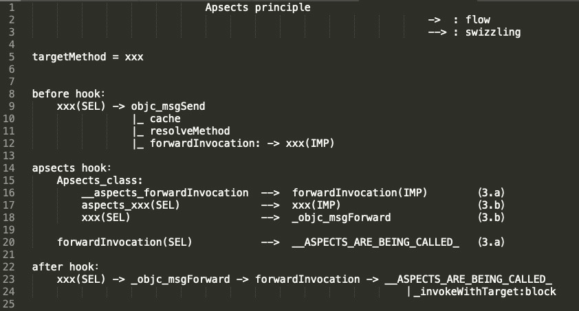

# Apsects


>  iOS AOP文章系列
>
>  前导知识：
>  * [Mach-O文件结构分析](https://houugen.fun/posts/mach-o%E6%96%87%E4%BB%B6%E7%BB%93%E6%9E%84%E5%88%86%E6%9E%90.html)
>  * [静态链接&动态链接](https://houugen.fun/posts/%E9%9D%99%E6%80%81%E9%93%BE%E6%8E%A5%E5%8A%A8%E6%80%81%E9%93%BE%E6%8E%A5.html)
>  * [OC方法&OC类&OC对象](https://houugen.fun/posts/oc%E6%96%B9%E6%B3%95oc%E7%B1%BBoc%E5%AF%B9%E8%B1%A1.html)
>  * [方法查找和消息转发](https://houugen.fun/posts/%E6%96%B9%E6%B3%95%E6%9F%A5%E6%89%BE%E5%92%8C%E6%B6%88%E6%81%AF%E8%BD%AC%E5%8F%91.html)
>
>  AOP框架：
>  * [Method Swizzling](https://houugen.fun/posts/method-swizzling.html)
>  * [Fishhook](https://houugen.fun/posts/fishhook.html)
>  * [Apsects](https://houugen.fun/posts/apsects.html)
>  * NSProxy AOP

 ## 介绍

> **Think of Aspects as method swizzling on steroids. It allows you to add code to existing methods per class or per instance**, whilst thinking of the insertion point e.g. before/instead/after. Aspects automatically deals with calling super and is easier to use than regular method swizzling.

从 [Apsects](https://github.com/steipete/Aspects) 的介绍可以看到利用 `swizzling` 技术来达到为类方法或实例方法添加额外逻辑。且有 `before` / `instead` / `after` 三种场景。

还是从 Demo 到源码分析。


强烈建议先阅读 [方法查找和消息转发](https://houugen.fun/posts/%E6%96%B9%E6%B3%95%E6%9F%A5%E6%89%BE%E5%92%8C%E6%B6%88%E6%81%AF%E8%BD%AC%E5%8F%91.html) 文章来理解 `Runtime` 动态消息发送机制。


## 玩坏的🌰

继续用之前的 Demo，我们在 **Method Swizzling文章** 中曾经为 `Person` 类扩展了一个 `eat` 方法，我们稍微修改下，加个入参但不处理，我们希望通过使用 Apsects hook 这个函数来打印入参 `food` 并在函数执行完成后对 `food` 做出评价：

```objective-c
// Person + swizzle.m
@implementation Person (swizzle)

- (void)eat:(NSString *)food {
    NSLog(@"i am eating");
}

@end

// main.m
//        ==== Apsects ====
Person *p = [[Person alloc] init];

// apsects 的 hook 接口
[p aspect_hookSelector:@selector(eat:) withOptions:AspectPositionAfter usingBlock:^(id<AspectInfo> aspectInfo) {
    NSLog(@"%@", aspectInfo.arguments[0]);
    NSLog(@"so delicious!");
} error:NULL];

[p eat:@"Mapo Tofu"];
```



## 源码分析

### 入口

```objective-c
/// Adds a block of code before/instead/after the current `selector` for a specific class.
///
/// @param block Aspects replicates the type signature of the method being hooked.
/// The first parameter will be `id<AspectInfo>`, followed by all parameters of the method.
/// These parameters are optional and will be filled to match the block signature.
/// You can even use an empty block, or one that simple gets `id<AspectInfo>`.
///
/// @note Hooking static methods is not supported.
/// @return A token which allows to later deregister the aspect.
+ (id<AspectToken>)aspect_hookSelector:(SEL)selector
                      withOptions:(AspectOptions)options
                       usingBlock:(id)block
                            error:(NSError **)error {
    return aspect_add((id)self, selector, options, block, error);
}

/// @return A token which allows to later deregister the aspect.
- (id<AspectToken>)aspect_hookSelector:(SEL)selector
                      withOptions:(AspectOptions)options
                       usingBlock:(id)block
                            error:(NSError **)error {
    return aspect_add(self, selector, options, block, error);
}
```

根据注释可知这里 `usingBlock` 是 hook 方法后要修改的逻辑，入参第一个`id<AspectInfo>`，第二个开始是原方法参数。返回 `AspectToken` 对象。

```objective-c
static id aspect_add(id self, SEL selector, AspectOptions options, id block, NSError **error) {
    NSCParameterAssert(self);
    NSCParameterAssert(selector);
    NSCParameterAssert(block);

    __block AspectIdentifier *identifier = nil;
    aspect_performLocked(^{
        // 1. 判断 SEL 是否允许 hook
        if (aspect_isSelectorAllowedAndTrack(self, selector, options, error)) {
            // 2. AspectsContainer <== addAspect:withOption: == AspectIdentifier，
            // 创建 AspectsContainer 结构
            AspectsContainer *aspectContainer = aspect_getContainerForObject(self, selector);
            // 将信息整理成 AspectIdentifier 结构
            identifier = [AspectIdentifier identifierWithSelector:selector object:self options:options block:block error:error];
            if (identifier) {
                // 将 AspectIdentifier 加入 AspectsContainer
                [aspectContainer addAspect:identifier withOptions:options];

                // Modify the class to allow message interception.
                // 3. 消息拦截
                aspect_prepareClassAndHookSelector(self, selector, error);
            }
        }
    });
    return identifier;
}
```

### 1. 判断是否能 hook

`aspect_isSelectorAllowedAndTrack` 源码不贴了，主要做黑名单和是否重复 hook 检查：

- `SEL` 不能为 `retain`、`release`、`autorelease`、`forwardInvocation`:
- `AspectPositionBefore` 场景，`SEL` 不能为 `dealloc`
- 对象或类中需要找到 `SEL`
- 检查子类和父类是否 hook 过目标方法

### 2. 记录数据结构

这里主要说明两个数据结构

```objective-c
@interface AspectIdentifier : NSObject
+ (instancetype)identifierWithSelector:(SEL)selector object:(id)object options:(AspectOptions)options block:(id)block error:(NSError **)error;
- (BOOL)invokeWithInfo:(id<AspectInfo>)info;
@property (nonatomic, assign) SEL selector;
@property (nonatomic, strong) id block;
@property (nonatomic, strong) NSMethodSignature *blockSignature;
@property (nonatomic, weak) id object;
@property (nonatomic, assign) AspectOptions options;
@end

@interface AspectsContainer : NSObject
- (void)addAspect:(AspectIdentifier *)aspect withOptions:(AspectOptions)injectPosition;
- (BOOL)removeAspect:(id)aspect;
- (BOOL)hasAspects;
@property (atomic, copy) NSArray *beforeAspects;
@property (atomic, copy) NSArray *insteadAspects;
@property (atomic, copy) NSArray *afterAspects;
@end
```

- `AspectIdentifier`：切面，包含切面的具体内容如方法签名、执行时机等
- `AspectsContainer`： 切面容器，装载切面

### 3. 消息拦截（核心）

```objective-c
static void aspect_prepareClassAndHookSelector(NSObject *self, SEL selector, NSError **error) {
    NSCParameterAssert(selector);
    // a. 替换 forwardInvocation
    Class klass = aspect_hookClass(self, error);
    Method targetMethod = class_getInstanceMethod(klass, selector);
    IMP targetMethodIMP = method_getImplementation(targetMethod);
    // imp 不是 _objc_msgForward 则进行方法替换
    if (!aspect_isMsgForwardIMP(targetMethodIMP)) {
        // Make a method alias for the existing method implementation, it not already copied.
        // b. 替换 _objc_msgForward
        const char *typeEncoding = method_getTypeEncoding(targetMethod);
        SEL aliasSelector = aspect_aliasForSelector(selector);
        if (![klass instancesRespondToSelector:aliasSelector]) {
            __unused BOOL addedAlias = class_addMethod(klass, aliasSelector, method_getImplementation(targetMethod), typeEncoding);
        }

        // We use forwardInvocation to hook in.
        class_replaceMethod(klass, selector, aspect_getMsgForwardIMP(self, selector), typeEncoding);
    }
}
```

#### a. 替换forwardInvocation

```objective-c
static Class aspect_hookClass(NSObject *self, NSError **error) {
    Class statedClass = self.class;
    Class baseClass = object_getClass(self);
    NSString *className = NSStringFromClass(baseClass);

    ...
        
    // Default case. Create dynamic subclass.
    // 动态创建一个后缀为： 原类名的类 + _Apsects_
    const char *subclassName = [className stringByAppendingString:AspectsSubclassSuffix].UTF8String;
    // 获取 isa
    Class subclass = objc_getClass(subclassName);

    if (subclass == nil) {
        // 动态创建subclass类
        subclass = objc_allocateClassPair(baseClass, subclassName, 0);
        if (subclass == nil) {
            NSString *errrorDesc = [NSString stringWithFormat:@"objc_allocateClassPair failed to allocate class %s.", subclassName];
            AspectError(AspectErrorFailedToAllocateClassPair, errrorDesc);
            return nil;
        }
        
        // swizzle forwardInvocation:
        aspect_swizzleForwardInvocation(subclass);
        // 修改实例对象方法和类方法为之前状态，保证行为一致不影响外界使用
        aspect_hookedGetClass(subclass, statedClass);
        aspect_hookedGetClass(object_getClass(subclass), statedClass);
        // 注册subclass类
        objc_registerClassPair(subclass);
    }

    // self.isa -> subclass
    object_setClass(self, subclass);
    return subclass;
}
```

这里进行了第一次 `swizzling`，替换 `forwardInvocation` ：

```objective-c
static void aspect_swizzleForwardInvocation(Class klass) {
    // 将 forwardInvocation: 指向自实现的 __ASPECTS_ARE_BEING_CALLED__ 
    IMP originalImplementation = class_replaceMethod(klass, @selector(forwardInvocation:), (IMP)__ASPECTS_ARE_BEING_CALLED__, "v@:@");
    if (originalImplementation) {
        // 增加一个名为 __aspects_forwardInvocation: 的方法指向 forwardInvocation: 原实现
        class_addMethod(klass, NSSelectorFromString(AspectsForwardInvocationSelectorName), originalImplementation, "v@:@");
    }
}
```

自实现的 `__ASPECTS_ARE_BEING_CALLED__` 的主要功能就是匹配不同的执行时机，然后通过 `aspect_invoke` 宏定义去执行 `block` 中自定义的逻辑。

 `aspect_invoke` 调用 `- (BOOL)invokeWithInfo:(id<AspectInfo>)info`，该方法通过前面记录的方法签名和参数执行 `invoke` 调用（`[blockInvocation invokeWithTarget:self.block]`）

```objective-c
static void __ASPECTS_ARE_BEING_CALLED__(__unsafe_unretained NSObject *self, SEL selector, NSInvocation *invocation) {
    
    SEL originalSelector = invocation.selector;
    // SEL 新方法名: alias_原sel名， 这个 aliasSelector 在后边 SEL swizzle 中做交换用到的
    SEL aliasSelector = aspect_aliasForSelector(invocation.selector);
    invocation.selector = aliasSelector;
    // 根据 aliasSelector 找到容器
    AspectsContainer *objectContainer = objc_getAssociatedObject(self, aliasSelector);
    AspectsContainer *classContainer = aspect_getContainerForClass(object_getClass(self), aliasSelector);
    AspectInfo *info = [[AspectInfo alloc] initWithInstance:self invocation:invocation];
    NSArray *aspectsToRemove = nil;

    // 根据不同时机调用 aspect_invoke
    // Before hooks.
    aspect_invoke(classContainer.beforeAspects, info);
    aspect_invoke(objectContainer.beforeAspects, info);

    // Instead hooks.
    ...
        
    // After hooks.
    ...

    // If no hooks are installed, call original implementation (usually to throw an exception)
    if (!respondsToAlias) {
        invocation.selector = originalSelector;
        SEL originalForwardInvocationSEL = NSSelectorFromString(AspectsForwardInvocationSelectorName);
        if ([self respondsToSelector:originalForwardInvocationSEL]) {
            ((void( *)(id, SEL, NSInvocation *))objc_msgSend)(self, originalForwardInvocationSEL, invocation);
        }else {
            [self doesNotRecognizeSelector:invocation.selector];
        }
    }

    // Remove any hooks that are queued for deregistration.
    [aspectsToRemove makeObjectsPerformSelector:@selector(remove)];
}

#define aspect_invoke(aspects, info) \
for (AspectIdentifier *aspect in aspects) {\
    [aspect invokeWithInfo:info];\
    if (aspect.options & AspectOptionAutomaticRemoval) { \
        aspectsToRemove = [aspectsToRemove?:@[] arrayByAddingObject:aspect]; \
    } \
}

- (BOOL)invokeWithInfo:(id<AspectInfo>)info {
    NSInvocation *blockInvocation = [NSInvocation invocationWithMethodSignature:self.blockSignature];
    NSInvocation *originalInvocation = info.originalInvocation;
    NSUInteger numberOfArguments = self.blockSignature.numberOfArguments;

    ...
    [blockInvocation setArgument:&info atIndex:1];
    
    ...
    [blockInvocation invokeWithTarget:self.block];
    
}
```

#### b. 替换_objc_msgForward

```objective-c
class_addMethod(klass, aliasSelector, method_getImplementation(targetMethod), typeEncoding);
class_replaceMethod(klass, selector, aspect_getMsgForwardIMP(self, selector), typeEncoding);
```

将 `aliasSelector` 的实现指向目标方法实现，而目标方法 `SEL` 的实现指向 `_objc_msgForward`，做了第二次 `swizzling`。

## 总结

整个核心实现过程为：

1. 创建 `subclass`，并处理与 `self` 指针和方法的关系。每次都创建 `subclass` 的目的是为单个实例对象实现了 hook 处理 ， 而不会影响到其他同类的实例对象 。
2. 交换 `__aspects_forwardInvocation:`（`subclass` 中新加的方法） 和 `forwardInvocation:` 实现，`forwardInvocation:` 指向  `apsects` 定义的 `__ASPECTS_ARE_BEING_CALLED_` 来 `invoke` 用户定义的 `block`。
3. 交换 `targetMethod` 的 `selector` 和 `aliasSelector`（`subclass`中新加的方法）实现，`selector` 指向 `_objc_msgForward`，aliasSelector 指向 `targetMethod` 的 `IMP`。
4. 替换前，调用函数进行消息发送的流程是：**targetMethod_SEL -> objc_msgSend -> _objc_msgForward -> forwardInvocation: -> targetMethod_IMP**
5. 整个替换后，流程是：**targetMethod_SEL -> objc_msgForward -> forwardInvocation:  -> ASPECTS_ARE_BEING_CALLED**


