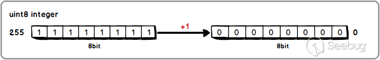
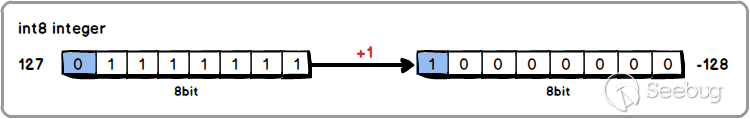
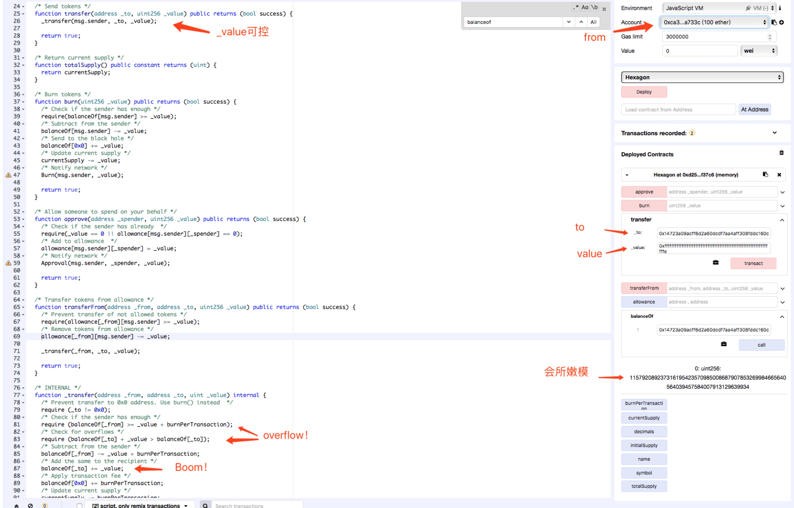
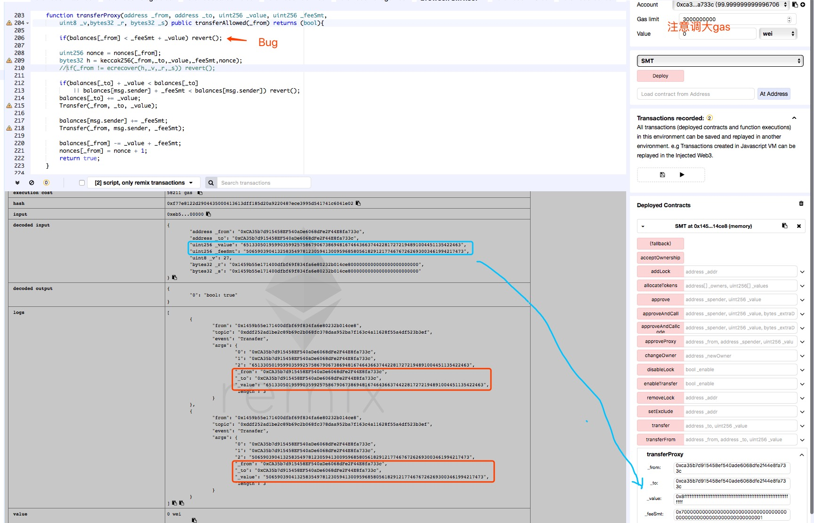
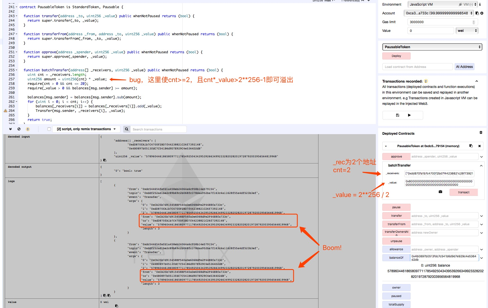

# #DASP# Arithmetic Issues (3)


## 0x00 Info

[Arithmetic Issues](https://www.dasp.co/#item-3)为DASP TOP10的第三类漏洞。这类算数漏洞比较常见
> also known as **integer overflow** and **integer underflow**

<!-- more -->

## 0x01 原理

整型溢出的原理很简单，以8位整型为例，借图说明**上溢**。

8位无符号整型范围[0, 255]:


8位有符号整型范围[-128, 127]:


对于**下溢** `(unit8)0-1=(uint8)255`, `(int8)(-128)-1=(int8)127`.

## 0x02 场景

对于智能合约常见的整型溢出漏洞，会出现在如下场景：
1. 经典场景，没有检查下溢
```solidity
function withdraw(uint _amount) {
	require(balances[msg.sender] - _amount > 0); // 如果 _amount > msg.sender, underflow 
	msg.sender.transfer(_amount);  // 会transfer一个很大的值
	balances[msg.sender] -= _amount;
}
```

2. off-by-one
```solidity
function popArrayOfThings() {
	require(arrayOfThings.length >= 0);
	arrayOfThings.length--;  // length是uint，当length=0，length--会下溢翻转；同样++也需要注意
}
```

3. 关键字var
var会根据分配值更改为最小适配类型，下例中i=0，因此i被分配为uint8。因此i最大255，当somethingLarge>256时，i就会上溢。
```solidity
for (var i = 0; i < somethingLarge; i ++) {
	// ...
}
```

## 0x03 实例

### 上溢漏洞

#### Hexagon

分析：[代币变泡沫，以太坊Hexagon溢出漏洞比狗庄还过分](https://www.anquanke.com/post/id/145520)
Code: [Source Code](https://etherscan.io/address/0xB5335e24d0aB29C190AB8C2B459238Da1153cEBA#code)

漏洞函数：
```solidity
function _transfer(address _from, address _to, uint _value) internal {
    /* Prevent transfer to 0x0 address. Use burn() instead  */
    require (_to != 0x0);
    /* Check if the sender has enough */
    require (balanceOf[_from] >= _value + burnPerTransaction);   // Boom!
    /* Check for overflows */
    require (balanceOf[_to] + _value > balanceOf[_to]);
    /* Subtract from the sender */
    balanceOf[_from] -= _value + burnPerTransaction;
    /* Add the same to the recipient */
    balanceOf[_to] += _value;
    /* Apply transaction fee */
    balanceOf[0x0] += burnPerTransaction;
    /* Update current supply */
    currentSupply -= burnPerTransaction;
    /* Notify network */
    Burn(_from, burnPerTransaction);
    /* Notify network */
    Transfer(_from, _to, _value);
}
```

典型的整型上溢漏洞。

通过remix可以复现漏洞：


#### SMT

分析：
* [Solidity合约中的整数安全问题——SMT/BEC合约整数溢出解析](https://www.anquanke.com/post/id/106382)
* [New proxyOverflow Bug in Multiple ERC20 Smart Contracts (CVE-2018-10376)](https://peckshield.com/2018/04/25/proxyOverflow/)

Code: 
* [Source Code](https://etherscan.io/address/0x55f93985431fc9304077687a35a1ba103dc1e081#code) 

漏洞函数：
```solidity
function transferProxy(address _from, address _to, uint256 _value, uint256 _feeSmt,
    uint8 _v,bytes32 _r, bytes32 _s) public transferAllowed(_from) returns (bool){

    if(balances[_from] < _feeSmt + _value) revert();   // Boom!

    uint256 nonce = nonces[_from];
    bytes32 h = keccak256(_from,_to,_value,_feeSmt,nonce);
    if(_from != ecrecover(h,_v,_r,_s)) revert();

    if(balances[_to] + _value < balances[_to]
        || balances[msg.sender] + _feeSmt < balances[msg.sender]) revert();
    balances[_to] += _value;
    Transfer(_from, _to, _value);

    balances[msg.sender] += _feeSmt;
    Transfer(_from, msg.sender, _feeSmt);

    balances[_from] -= _value + _feeSmt;
    nonces[_from] = nonce + 1;
    return true;
}
```

通过remix可以复现漏洞：


#### BEC

分析：
* [ALERT: New batchOverflow Bug in Multiple ERC20 Smart Contracts (CVE-2018-10299)](https://peckshield.com/2018/04/22/batchOverflow/)

Code: 
* [Source Code](https://etherscan.io/address/0xc5d105e63711398af9bbff092d4b6769c82f793d#code)

漏洞函数：
```solidity
function batchTransfer(address[] _receivers, uint256 _value) public whenNotPaused returns (bool) {
    uint cnt = _receivers.length;
    uint256 amount = uint256(cnt) * _value;   // Boom!
    require(cnt > 0 && cnt <= 20);
    require(_value > 0 && balances[msg.sender] >= amount);

    balances[msg.sender] = balances[msg.sender].sub(amount);
    for (uint i = 0; i < cnt; i++) {
        balances[_receivers[i]] = balances[_receivers[i]].add(_value);
        Transfer(msg.sender, _receivers[i], _value);
    }
    return true;
}
```

通过remix可以复现漏洞：


### 下溢漏洞

#### MerdeToken

以上的漏洞都很简单，简单分析既能找到Bug，而这个漏洞就很有意思了，一度被怀疑是后门。

分析：
* [MerdeToken: It's Some Hot Shit](https://github.com/Arachnid/uscc/blob/master/submissions-2017/doughoyte/README.md)

Code: 
* [Source Code](https://github.com/Arachnid/uscc/blob/master/submissions-2017/doughoyte/MerdeToken.sol)

MDT就是一个token contract，你可以通过该合约设置信任第三方及取币额度，还有常规的存币，交易和取币操作。但该合约额外提供了并不需要的奖金代码操作，而此功能存在漏洞，可以任意修改取币额度限制，因此被怀疑是后门。

漏洞其实很简单，bonusCodes.length如果等于0，bonusCodes.length--会造成下溢翻转变为 2**256-1。
```solidity
function popBonusCode() onlyOwner {
    require(bonusCodes.length >= 0);
    bonusCodes.length--;   //  Boom!
}
```

漏洞的[利用](https://github.com/Arachnid/uscc/blob/master/submissions-2017/doughoyte/README.md#exploitation)方式很有趣，有点像二进制中的栈溢出和任意内存写，这里着重讲解。

首先你需要理解Solidity中的状态变量存储模型（[Layout of State Variables in Storage](http://solidity.readthedocs.io/en/develop/miscellaneous.html#layout-of-state-variables-in-storage)）。
理解模型有几个关键点：
* 合约的存储由一个256位指针处理，而合约内的变量都存储在以合约指针为基址的偏移地址中。
* 大小固定的变量（除了mapping，变长数组以外的所有类型）在存储中是依次连续从位置0开始排列在一个个32字节槽中。
* 如果多个变量占用的大小少于32字节，会尽可能的打包到单个槽位里。
* 由于mapping和变长数组的大小不可预知，因此定义使用keccak256哈希来计算数据存储位置。
	- 对于mapping，会在mapping定义位置（**p**）占用一个槽位，但其中无数据，而数据存储位置通过 `keccak256(k . p)`计算得到，k为mapping键。
	- 对于动态数组，会在数组定义位置（**p**）占用一个槽位，存储数组元素个数，而数据存储位置通过 `keccak256(p)`计算得到。

其中第四点比较难理解，我们通过该MerdeToken合约说明。
在MerdeToken中定义了如下状态变量：
```solidity
address public owner;
address public trustedThirdParty;
mapping (address => uint) public balanceOf;
uint public deposited;
uint public withdrawLimit;
uint[] public bonusCodes;
```
在storage中从位置0依次排列
```json
"storage": {
	0x00 : (address)owner,
	0x01 : (address)trustedThirdParty,
	0x02 : (mapping)balanceOf,
	0x03 : (uint)deposited,
	0x04 : (uint)withdrawLimit,
	0x05 : (uint[])bonusCodes
}
```
其中balanceOf为mapping映射，而位置为0x02，因此在0x02位置为空值，而balanceOf中k对应的value在storage中的存储位置计算方式为keccak256(k . 0x02)。
bonusCodes为动态数组，位置为0x05，故在0x05中存储数组长度（数组有值后），而bonusCodes数组起始位置在storage中计算方式为keccak256(0x05)。

Ok，理解了以上，接下来就说下如何通过bonusCodes整型下溢来修改withdrawLimit值，这是另一个难点。

storage有256位的地址空间，状态变量从地址0依次排列，而通过 `bonusCodes.length--` 溢出使得bonusCodes数组长度变为2**256-1，覆盖了几乎所有storage地址空间。因此withdrawLimit变量也在bonusCodes数组中，需要计算找到withdrawLimit对应的数组下标。

计算方式：[Converting Array Indices to Addresses](https://github.com/Arachnid/uscc/blob/master/submissions-2017/doughoyte/README.md#converting-array-indices-to-addresses)

画个图帮你理解：
```
                            storage
                  + --------------------------- +      --   
          0x00    | owner                       |     |  |  <- index: 2**256-keccak256(0x05)
                  + --------------------------- +     |  |
          0x01    | trustedThirdParty           |     |  |
                  + --------------------------- +     |  |
          0x02    | balanceOf(None)             |     |  |
                  + --------------------------- +     |  |
          0x03    | deposited                   |     v  |
                  + --------------------------- +     |  |  
          0x04    | withdrawLimit               |     |  |  <- index: 2**256-keccak256(0x05)+4
                  + --------------------------- +     |  |
          0x05  --| bonusCodes.length           |     |  |
               |  + --------------------------- +     |  |
               |  |                             |     |  |
               |  + --------------------------- +     |  ^
               |  | ...                         |     |  |
               |  + --------------------------- +     V  |
               |  |                             |        |
               |  + --------------------------- +  ->-   |  
keccak256(0x05) ->| address(bonusCodes)         |     |  |  <- index: 0
                  + --------------------------- +     |  |
                  |                             |     |  |
                  + --------------------------- +     v  |
                  | ...                         |     |  |
                  + --------------------------- +     |  |
      2**256-1    |                             |      --  
                  + --------------------------- +       
```

最后就是通过合约提供的modifyBonusCode函数修改withdrawLimit值来突破取币额度的限制。
