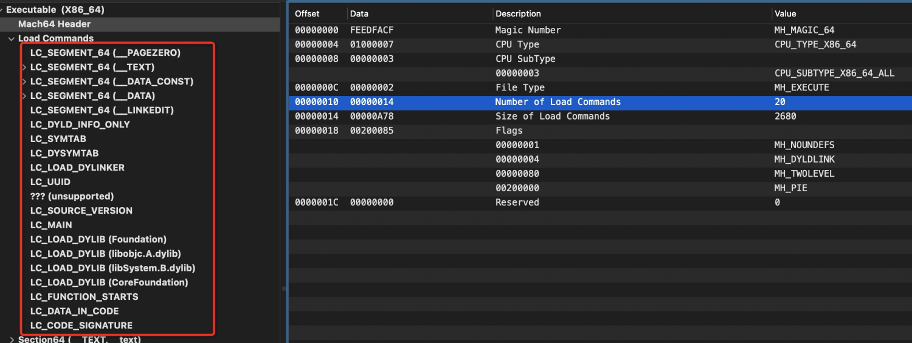
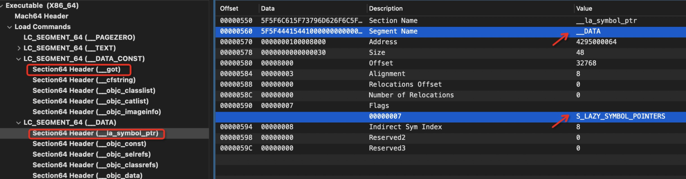

# Fishhook


>  iOS AOP文章系列
>
>  前导知识：
>  * [Mach-O文件结构分析](https://houugen.fun/posts/mach-o%E6%96%87%E4%BB%B6%E7%BB%93%E6%9E%84%E5%88%86%E6%9E%90.html)
>  * [静态链接&动态链接](https://houugen.fun/posts/%E9%9D%99%E6%80%81%E9%93%BE%E6%8E%A5%E5%8A%A8%E6%80%81%E9%93%BE%E6%8E%A5.html)
>  * [OC方法&OC类&OC对象](https://houugen.fun/posts/oc%E6%96%B9%E6%B3%95oc%E7%B1%BBoc%E5%AF%B9%E8%B1%A1.html)
>  * [方法查找和消息转发](https://houugen.fun/posts/%E6%96%B9%E6%B3%95%E6%9F%A5%E6%89%BE%E5%92%8C%E6%B6%88%E6%81%AF%E8%BD%AC%E5%8F%91.html)
>
>  AOP框架：
>  * [Method Swizzling](https://houugen.fun/posts/method-swizzling.html)
>  * [Fishhook](https://houugen.fun/posts/fishhook.html)
>  * Apsects
>  * NSProxy AOP

[fishhook](https://github.com/facebook/fishhook) 是 `facebook` 开源的一款简单易用的动态 hook 框架。一起学习下其原理。

## 还是那个🌰

在 **OC方法&OC类&OC对象** 中讲元类的时候分配注册了一个 `Student` 类，并实现了 `study` 方法，but 学生表面学习，内心还是向往诗和远方，因此我们想通过 `Fishhook` 动态 Hook `NSLog` 系统函数来表达学生党的真实内心：

```objective-c
// main.m
void StudyFunction(id self, SEL _cmd)
{
    NSLog(@"i am studing");
}

// 定义函数指针用来保存原始函数
static void (*orig_nslog)(NSString * format,...);

// 定义新函数扩展 NSLog 
void newNSLog(NSString * format,...) {
    format = [format stringByAppendingFormat:@"\tOS: i want to play!"];
    // 调用原始 NSLog
    orig_nslog(format);
}

int main(int argc, const char * argv[]) {
    
    @autoreleasepool {
        
//        === create class ====
        // 为class pair分配内存
        Class newClass = objc_allocateClassPair([Person class], "Student", 0);
        // 为新类添加方法
        class_addMethod(newClass, @selector(study), (IMP)StudyFunction, "v@:");
        // 注册类
        objc_registerClassPair(newClass);
        // 创建实例对象
        id s = [[newClass alloc] init];

//        ==== fishhook ====
        // 通过 rebind_symbols 接口实现函数重绑定到自实现函数上
        rebind_symbols((struct rebinding[1]){"NSLog", newNSLog, (void *)&orig_nslog}, 1);
        [s performSelector:@selector(study)];
    }
    return 0;
}
```


需要在工程中集成 `fishhook.h` 和 `fishhook.c` 文件




Fishhook 的使用非常简单，实现一个新函数并通过 `rebind_symbols` 接口即可完成重绑定。而且我们注意到 `struct rebinding` 结构体是个数组，还支持多个函数的 hook。

## 源码分析

```c
int rebind_symbols(struct rebinding rebindings[], size_t rebindings_nel) {
  // 1
  int retval = prepend_rebindings(&_rebindings_head, rebindings, rebindings_nel);
  if (retval < 0) {
    return retval;
  }
  // If this was the first call, register callback for image additions (which is also invoked for
  // existing images, otherwise, just run on existing images
  if (!_rebindings_head->next) {
    // 2
    _dyld_register_func_for_add_image(_rebind_symbols_for_image);
  } else {
    uint32_t c = _dyld_image_count();
    // 3
    for (uint32_t i = 0; i < c; i++) {
      _rebind_symbols_for_image(_dyld_get_image_header(i), _dyld_get_image_vmaddr_slide(i));
    }
  }
  return retval;
}
```

我们将 `rebind_symbols` 分为三部分

### prepend_rebindings

```c
struct rebinding {
  const char *name;
  void *replacement;
  void **replaced;
};

struct rebindings_entry {
  struct rebinding *rebindings;
  size_t rebindings_nel;
  struct rebindings_entry *next;
};

static struct rebindings_entry *_rebindings_head;

static int prepend_rebindings(struct rebindings_entry **rebindings_head,
                              struct rebinding rebindings[],
                              size_t nel) {
  // 定义 rebindings_entry 节点
  struct rebindings_entry *new_entry = (struct rebindings_entry *) malloc(sizeof(struct rebindings_entry));
  if (!new_entry) {
    return -1;
  }
  // 将 rebindings 拷贝到节点中
  new_entry->rebindings = (struct rebinding *) malloc(sizeof(struct rebinding) * nel);
  if (!new_entry->rebindings) {
    free(new_entry);
    return -1;
  }
  memcpy(new_entry->rebindings, rebindings, sizeof(struct rebinding) * nel);
  new_entry->rebindings_nel = nel;
  // 依次链接节点
  new_entry->next = *rebindings_head;
  *rebindings_head = new_entry;
  return 0;
}
```

这部分代码很简单，就是创建一个链表数据结构，将每次传入的 `rebindings` 加入链表。

### _dyld_register_func_for_add_image

第一调用会进入 `_dyld_register_func_for_add_image(_rebind_symbols_for_image)` 逻辑，

```c
/*
 * The following functions allow you to install callbacks which will be called   
 * by dyld whenever an image is loaded or unloaded.  During a call to _dyld_register_func_for_add_image()
 * the callback func is called for every existing image.  Later, it is called as each new image
 * is loaded and bound (but initializers not yet run).  The callback registered with
 * _dyld_register_func_for_remove_image() is called after any terminators in an image are run
 * and before the image is un-memory-mapped.
 */
extern void _dyld_register_func_for_add_image(void (*func)(const struct mach_header* mh, intptr_t vmaddr_slide))    __OSX_AVAILABLE_STARTING(__MAC_10_1, __IPHONE_2_0);
```

根据注释，`_dyld_register_func_for_add_image` 主要作用是为镜像注册回调函数，当镜像加载并未初始化时调用回调函数。

这里判断为第一次调用会注册 `_rebind_symbols_for_image` 回调。否则为每个镜像执行 `_rebind_symbols_for_image`。

### _rebind_symbols_for_image

```c
static void rebind_symbols_for_image(struct rebindings_entry *rebindings,
                                     const struct mach_header *header,
                                     intptr_t slide) {
  Dl_info info;
  if (dladdr(header, &info) == 0) {
    return;
  }

  segment_command_t *cur_seg_cmd;
  segment_command_t *linkedit_segment = NULL;
  struct symtab_command* symtab_cmd = NULL;
  struct dysymtab_command* dysymtab_cmd = NULL;

  uintptr_t cur = (uintptr_t)header + sizeof(mach_header_t);
  // 遍历 Macho-O 的 Load Commands 来找到 __LINKEDIT、LC_SYMTAB、LC_DYSYMTAB 段
  for (uint i = 0; i < header->ncmds; i++, cur += cur_seg_cmd->cmdsize) {
    cur_seg_cmd = (segment_command_t *)cur;
    if (cur_seg_cmd->cmd == LC_SEGMENT_ARCH_DEPENDENT) {
      if (strcmp(cur_seg_cmd->segname, SEG_LINKEDIT) == 0) {
        linkedit_segment = cur_seg_cmd;
      }
    } else if (cur_seg_cmd->cmd == LC_SYMTAB) {
      symtab_cmd = (struct symtab_command*)cur_seg_cmd;
    } else if (cur_seg_cmd->cmd == LC_DYSYMTAB) {
      dysymtab_cmd = (struct dysymtab_command*)cur_seg_cmd;
    }
  }

  if (!symtab_cmd || !dysymtab_cmd || !linkedit_segment ||
      !dysymtab_cmd->nindirectsyms) {
    return;
  }

  // Find base symbol/string table addresses
  // 各段结构中存在相对文件的偏移，那我们找到当前镜像的基址，就可以计算内存中各段真实地址，这里选用 __LINKEDIT 段来做基址计算
  // linkedit 内存真实地址 = ASLR 偏移 + linkedit 虚拟地址
  // 基址 = linkedit 内存真实地址 - linkedit 文件偏移
  uintptr_t linkedit_base = (uintptr_t)slide + linkedit_segment->vmaddr - linkedit_segment->fileoff;
  nlist_t *symtab = (nlist_t *)(linkedit_base + symtab_cmd->symoff);
  char *strtab = (char *)(linkedit_base + symtab_cmd->stroff);

  // Get indirect symbol table (array of uint32_t indices into symbol table)
  uint32_t *indirect_symtab = (uint32_t *)(linkedit_base + dysymtab_cmd->indirectsymoff);

  cur = (uintptr_t)header + sizeof(mach_header_t);
  // 遍历 __DATA_CONST 和 __DATA 段找到 __got 和 __la_symbol_ptr 节，找到后进入 perform_rebinding_with_section 逻辑
  for (uint i = 0; i < header->ncmds; i++, cur += cur_seg_cmd->cmdsize) {
    cur_seg_cmd = (segment_command_t *)cur;
    if (cur_seg_cmd->cmd == LC_SEGMENT_ARCH_DEPENDENT) {
      if (strcmp(cur_seg_cmd->segname, SEG_DATA) != 0 &&
          strcmp(cur_seg_cmd->segname, SEG_DATA_CONST) != 0) {
        continue;
      }
      for (uint j = 0; j < cur_seg_cmd->nsects; j++) {
        section_t *sect =
          (section_t *)(cur + sizeof(segment_command_t)) + j;
        if ((sect->flags & SECTION_TYPE) == S_LAZY_SYMBOL_POINTERS) {
          perform_rebinding_with_section(rebindings, sect, slide, symtab, strtab, indirect_symtab);
        }
        if ((sect->flags & SECTION_TYPE) == S_NON_LAZY_SYMBOL_POINTERS) {
          perform_rebinding_with_section(rebindings, sect, slide, symtab, strtab, indirect_symtab);
        }
      }
    }
  }
}
```

上述源码第一处循环主要遍历下图红框中段找到 `__LINKEDIT`、`LC_SYMTAB`、`LC_DYSYMTAB`



第二处循环主要找 `got` 和 `la_symbol_ptr` 两个表



### perform_rebinding_with_section

```c
static void perform_rebinding_with_section(struct rebindings_entry *rebindings,
                                           section_t *section,
                                           intptr_t slide,
                                           nlist_t *symtab,
                                           char *strtab,
                                           uint32_t *indirect_symtab) {
  const bool isDataConst = strcmp(section->segname, SEG_DATA_CONST) == 0;
  // 之前的动态链接文章讲到，reserved1 为 got 表对应于 indirect symbols 中 reserved1 起始的项
  // 即 got[n] = inderect_symbols[n + reserved1]
  // 这里计算动态符号表中 got 表对应的起始位置元素
  uint32_t *indirect_symbol_indices = indirect_symtab + section->reserved1;
  // 获取 Section64(__DATA_CONST,__got) 或 Section64(__DATA,__la_symbol_ptr) 
  void **indirect_symbol_bindings = (void **)((uintptr_t)slide + section->addr);
  vm_prot_t oldProtection = VM_PROT_READ;
  if (isDataConst) {
    oldProtection = get_protection(rebindings);
    mprotect(indirect_symbol_bindings, section->size, PROT_READ | PROT_WRITE);
  }
  for (uint i = 0; i < section->size / sizeof(void *); i++) {
    // 动态符号表.index ==> 符号表[index]
    uint32_t symtab_index = indirect_symbol_indices[i];
    if (symtab_index == INDIRECT_SYMBOL_ABS || symtab_index == INDIRECT_SYMBOL_LOCAL ||
        symtab_index == (INDIRECT_SYMBOL_LOCAL   | INDIRECT_SYMBOL_ABS)) {
      continue;
    }
    // 符号表.index = 字符名偏移 ==>  字符串表 + index
    uint32_t strtab_offset = symtab[symtab_index].n_un.n_strx;
    char *symbol_name = strtab + strtab_offset;
    bool symbol_name_longer_than_1 = symbol_name[0] && symbol_name[1];
    struct rebindings_entry *cur = rebindings;
    // 遍历链表
    while (cur) {
      for (uint j = 0; j < cur->rebindings_nel; j++) {
        // 匹配方法名
        if (symbol_name_longer_than_1 &&
            strcmp(&symbol_name[1], cur->rebindings[j].name) == 0) {
          if (cur->rebindings[j].replaced != NULL &&
              indirect_symbol_bindings[i] != cur->rebindings[j].replacement) {
            // 记录原始跳转地址
            *(cur->rebindings[j].replaced) = indirect_symbol_bindings[i];
          }
          // 将新实现的方法地址写在 indirect_symbol_bindings 中完成替换
          indirect_symbol_bindings[i] = cur->rebindings[j].replacement;
          goto symbol_loop;
        }
      }
      cur = cur->next;
    }
  symbol_loop:;
  }
  if (isDataConst) {
    int protection = 0;
    if (oldProtection & VM_PROT_READ) {
      protection |= PROT_READ;
    }
    if (oldProtection & VM_PROT_WRITE) {
      protection |= PROT_WRITE;
    }
    if (oldProtection & VM_PROT_EXECUTE) {
      protection |= PROT_EXEC;
    }
    mprotect(indirect_symbol_bindings, section->size, protection);
  }
}
```

## 总结

其实 fishhook 的逻辑就是**已知符号（要 hook 的函数名）反推其在 `_got` / `__la_symbol_ptr` 表中的位置**，**然后将新实现函数真实地址写入**。而符号的查找过程在源码和注释中已经理的很清晰，通过[官网](https://github.com/facebook/fishhook)的图能更直观的看出几个表结构的关联。



我们还能得出一个结论，只有具有符号和符号绑定过程的函数才能通过 fishhook 进行 hook，运行时符号绑定也是我们之前讲过的 `PIC` 技术。因此自定义的 C 函数是无法使用 fishhook 的。
