# Mach-O 文件结构分析


>  iOS AOP文章系列
>
>  前导知识：
>  * [Mach-O文件结构分析](https://houugen.fun/posts/mach-o%E6%96%87%E4%BB%B6%E7%BB%93%E6%9E%84%E5%88%86%E6%9E%90.html)
>  * 静态链接&动态链接
>  * OC方法&OC类&OC对象
>  * 方法查找和消息转发
>
>  AOP框架：
>  * Method Swizzling
>  * Fishhook
>  * Apsects
>  * NSProxy AOP

## 二进制结构

使用 MachoView 工具查看二进制执行文件，结构为：

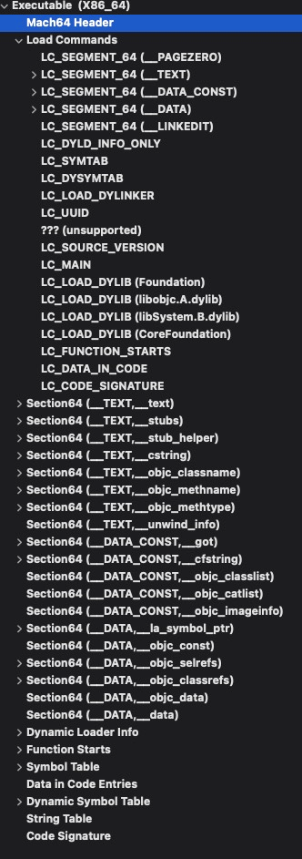

**Header** 头中魔术数字：

| **可执行格式** | **magic**                                   | **用途**                                                     |
| -------------- | ------------------------------------------- | ------------------------------------------------------------ |
| 脚本           | `\x7FELF`                                   | 主要用于 shell 脚本，但是也常用语其他解释器，如 Perl, AWK 等。也就是我们常见的脚本文件中在 `#!` 标记后的字符串，即为执行命令的指令方式，以文件的 stdin 来传递命令 |
| 通用二进制格式 | `0xcafebabe` `0xbebafeca`                   | 包含多种架构支持的二进制格式，只在 macOS 上支持              |
| Mach-O         | `0xfeedface`（32 位） `0xfeedfacf`（64 位） | macOS 的原生二进制格式                                       |


Mach-O 主要三部分：

- Header   // 描述 MachO 的 cpu 架构、文件类型和加载命令等信息
- Load Command   // 描述文件中数据具体组织结构，不同数据类型使用不同加载命令表示，在文件加载解析时，被内核加载器或动态链接器调用，包含段加载命令（`LC_SEGMENT_64`）
- Sections   //加载命令若包含节，节中具体存放数据或代码


具体数据结构定义可在[源码](https://opensource.apple.com/source/xnu/xnu-792.6.76/EXTERNAL_HEADERS/mach-o/loader.h)中查看： 

**Header**：

```objective-c
/*
 * The 64-bit mach header appears at the very beginning of object files for
 * 64-bit architectures.
 */
struct mach_header_64 {
    uint32_t    magic;      /* mach magic number identifier */
    cpu_type_t  cputype;    /* cpu specifier */
    cpu_subtype_t   cpusubtype; /* machine specifier */
    uint32_t    filetype;   /* type of file */
    uint32_t    ncmds;      /* number of load commands */
    uint32_t    sizeofcmds; /* the size of all the load commands */
    uint32_t    flags;      /* flags */
    uint32_t    reserved;   /* reserved */
};
```

**Segment**:

```objective-c
/*
 * The 64-bit segment load command indicates that a part of this file is to be
 * mapped into a 64-bit task's address space.  If the 64-bit segment has
 * sections then section_64 structures directly follow the 64-bit segment
 * command and their size is reflected in cmdsize.
 */
struct segment_command_64 { /* for 64-bit architectures */
    uint32_t    cmd;        /* LC_SEGMENT_64 */
    uint32_t    cmdsize;    /* includes sizeof section_64 structs */
    char        segname[16];    /* segment name */
    uint64_t    vmaddr;     /* memory address of this segment */
    uint64_t    vmsize;     /* memory size of this segment */
    uint64_t    fileoff;    /* file offset of this segment */
    uint64_t    filesize;   /* amount to map from the file */
    vm_prot_t   maxprot;    /* maximum VM protection */
    vm_prot_t   initprot;   /* initial VM protection */
    uint32_t    nsects;     /* number of sections in segment */
    uint32_t    flags;      /* flags */
};
```

**Sections**:

```objective-c
struct section_64 { /* for 64-bit architectures */
    char        sectname[16];   /* name of this section */
    char        segname[16];    /* segment this section goes in */
    uint64_t    addr;       /* memory address of this section */
    uint64_t    size;       /* size in bytes of this section */
    uint32_t    offset;     /* file offset of this section */
    uint32_t    align;      /* section alignment (power of 2) */
    uint32_t    reloff;     /* file offset of relocation entries */
    uint32_t    nreloc;     /* number of relocation entries */
    uint32_t    flags;      /* flags (section type and attributes)*/
    uint32_t    reserved1;  /* reserved (for offset or index) */
    uint32_t    reserved2;  /* reserved (for count or sizeof) */
    uint32_t    reserved3;  /* reserved */
};
```


`section_64` 的结构体中有几个比较重要的数据，`reloff`（重定位表偏移）、`nreloc`（重定位符号个数）、`reserved1`（动态符号表偏移），在静态链接和动态链接中发挥重要作用。

在 **静态链接&动态链接** 文章中加以介绍。


## 举个🌰直观感受下

简单Demo程序：

```objective-c
// person.m
NSString *string1 = @"it is string1";
NSString *string2;

@implementation Person

- (void)sleep {
    NSLog(@"i am sleeping");
}

- (void)walk {
    printf(@"i am walking");
}

+ (void)grow {
    static NSString *string3 = @"it is string3";
    static NSString *string4;
    NSLog(@"%@_%@", string3, string4);
}

@end

// person+other.m
@implementation Person (other)

- (void)ill {
    NSLog(@"i am fall ill");
}
- (void)sleep {
    NSLog(@"i need sleeping");
}

@end


// main.m
void run() {
    NSLog(@"i am running");
}

int main(int argc, const char * argv[]) {
    @autoreleasepool {
        // insert code here...
        NSLog(@"Hello, World!");
        
        Person *p = [[Person alloc] init];
        [p walk];
        [p ill];
        [p sleep];
        
        run();
    }
    return 0;
}
```

程序包含 `Person` 类，两个实例方法和一个类方法，同时包含一个 `Person` 的 `Category` 类，额外扩展和覆盖了原类。还实现了一个 C 函数 `run()`。


在 **LC_MAIN** 段可以知道程序 `main` 函数入口偏移地址 `0x3E00`：

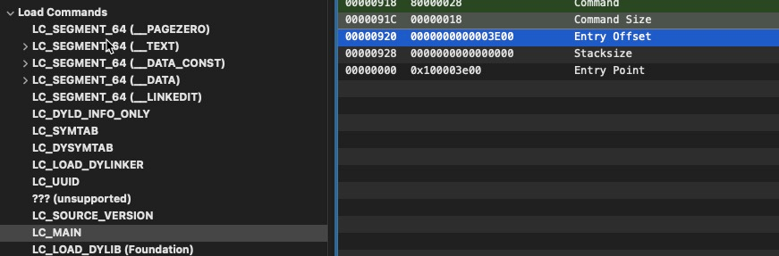

具体汇编代码在 **Section64(__TEXT,__text)** 中：

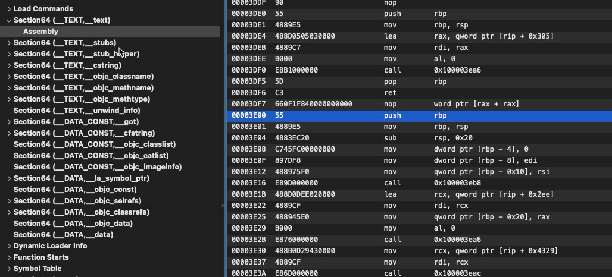

我们也可以使用 `otool` 工具反汇编代码，具体分析下程序如何使用各段节数据

```
➜  Debug otool -tV TestMacho1
TestMacho1:
(__TEXT,__text) section
-[Person(other) ill]:
0000000100003ce0    pushq   %rbp
0000000100003ce1    movq    %rsp, %rbp
0000000100003ce4    subq    $0x10, %rsp
0000000100003ce8    leaq    0x321(%rip), %rax       ## Objc cfstring ref: @"bad cfstring ref"
0000000100003cef    movq    %rdi, -0x8(%rbp)
0000000100003cf3    movq    %rsi, -0x10(%rbp)
0000000100003cf7    movq    %rax, %rdi
0000000100003cfa    movb    $0x0, %al
0000000100003cfc    callq   0x100003ea6             ## symbol stub for: _NSLog
0000000100003d01    addq    $0x10, %rsp
0000000100003d05    popq    %rbp
0000000100003d06    retq
0000000100003d07    nopw    (%rax,%rax)
-[Person(other) sleep]:
0000000100003d10    pushq   %rbp
0000000100003d11    movq    %rsp, %rbp
0000000100003d14    subq    $0x10, %rsp
0000000100003d18    leaq    0x311(%rip), %rax       ## Objc cfstring ref: @"bad cfstring ref"
0000000100003d1f    movq    %rdi, -0x8(%rbp)
0000000100003d23    movq    %rsi, -0x10(%rbp)
0000000100003d27    movq    %rax, %rdi
0000000100003d2a    movb    $0x0, %al
0000000100003d2c    callq   0x100003ea6             ## symbol stub for: _NSLog
0000000100003d31    addq    $0x10, %rsp
0000000100003d35    popq    %rbp
0000000100003d36    retq
0000000100003d37    nop
0000000100003d38    nop
0000000100003d39    nop
0000000100003d3a    nop
0000000100003d3b    nop
0000000100003d3c    nop
0000000100003d3d    nop
0000000100003d3e    nop
0000000100003d3f    nop
-[Person sleep]:
0000000100003d40    pushq   %rbp
0000000100003d41    movq    %rsp, %rbp
0000000100003d44    subq    $0x10, %rsp
0000000100003d48    leaq    0x321(%rip), %rax       ## Objc cfstring ref: @"bad cfstring ref"
0000000100003d4f    movq    %rdi, -0x8(%rbp)
0000000100003d53    movq    %rsi, -0x10(%rbp)
0000000100003d57    movq    %rax, %rdi
0000000100003d5a    movb    $0x0, %al
0000000100003d5c    callq   0x100003ea6             ## symbol stub for: _NSLog
0000000100003d61    addq    $0x10, %rsp
0000000100003d65    popq    %rbp
0000000100003d66    retq
0000000100003d67    nopw    (%rax,%rax)
-[Person walk]:
0000000100003d70    pushq   %rbp
0000000100003d71    movq    %rsp, %rbp
0000000100003d74    subq    $0x10, %rsp
0000000100003d78    leaq    0x311(%rip), %rax       ## Objc cfstring ref: @"bad cfstring ref"
0000000100003d7f    movq    %rdi, -0x8(%rbp)
0000000100003d83    movq    %rsi, -0x10(%rbp)
0000000100003d87    movq    %rax, %rdi
0000000100003d8a    movb    $0x0, %al
0000000100003d8c    callq   0x100003ec4             ## symbol stub for: _printf
0000000100003d91    addq    $0x10, %rsp
0000000100003d95    popq    %rbp
0000000100003d96    retq
0000000100003d97    nopw    (%rax,%rax)
+[Person grow]:
0000000100003da0    pushq   %rbp
0000000100003da1    movq    %rsp, %rbp
0000000100003da4    subq    $0x10, %rsp
0000000100003da8    leaq    0x321(%rip), %rax       ## Objc cfstring ref: @"bad cfstring ref"
0000000100003daf    movq    %rdi, -0x8(%rbp)
0000000100003db3    movq    %rsi, -0x10(%rbp)
0000000100003db7    movq    _grow.string3(%rip), %rsi
0000000100003dbe    movq    _grow.string4(%rip), %rdx
0000000100003dc5    movq    %rax, %rdi
0000000100003dc8    movb    $0x0, %al
0000000100003dca    callq   0x100003ea6             ## symbol stub for: _NSLog
0000000100003dcf    addq    $0x10, %rsp
0000000100003dd3    popq    %rbp
0000000100003dd4    retq
0000000100003dd5    nop
0000000100003dd6    nop
0000000100003dd7    nop
0000000100003dd8    nop
0000000100003dd9    nop
0000000100003dda    nop
0000000100003ddb    nop
0000000100003ddc    nop
0000000100003ddd    nop
0000000100003dde    nop
0000000100003ddf    nop
_run:
0000000100003de0    pushq   %rbp
0000000100003de1    movq    %rsp, %rbp
0000000100003de4    leaq    0x305(%rip), %rax       ## Objc cfstring ref: @"bad cfstring ref"
0000000100003deb    movq    %rax, %rdi
0000000100003dee    movb    $0x0, %al
0000000100003df0    callq   0x100003ea6             ## symbol stub for: _NSLog
0000000100003df5    popq    %rbp
0000000100003df6    retq
0000000100003df7    nopw    (%rax,%rax)
_main:
0000000100003e00    pushq   %rbp
0000000100003e01    movq    %rsp, %rbp
0000000100003e04    subq    $0x20, %rsp
0000000100003e08    movl    $0x0, -0x4(%rbp)
0000000100003e0f    movl    %edi, -0x8(%rbp)
0000000100003e12    movq    %rsi, -0x10(%rbp)
0000000100003e16    callq   0x100003eb8             ## symbol stub for: _objc_autoreleasePoolPush
0000000100003e1b    leaq    0x2ee(%rip), %rcx       ## Objc cfstring ref: @"bad cfstring ref"
0000000100003e22    movq    %rcx, %rdi
0000000100003e25    movq    %rax, -0x20(%rbp)
0000000100003e29    movb    $0x0, %al
0000000100003e2b    callq   0x100003ea6             ## symbol stub for: _NSLog
0000000100003e30    movq    0x4329(%rip), %rcx      ## Objc class ref: Person
0000000100003e37    movq    %rcx, %rdi
0000000100003e3a    callq   0x100003eac             ## symbol stub for: _objc_alloc_init
0000000100003e3f    movq    %rax, -0x18(%rbp)
0000000100003e43    movq    -0x18(%rbp), %rax
0000000100003e47    movq    0x42fa(%rip), %rsi      ## Objc selector ref: walk
0000000100003e4e    movq    %rax, %rdi
0000000100003e51    callq   *0x1a9(%rip)            ## Objc message: +[Person walk]
0000000100003e57    movq    -0x18(%rbp), %rax
0000000100003e5b    movq    0x42ee(%rip), %rsi      ## Objc selector ref: ill
0000000100003e62    movq    %rax, %rdi
0000000100003e65    callq   *0x195(%rip)            ## Objc message: -[%rdi ill]
0000000100003e6b    movq    -0x18(%rbp), %rax
0000000100003e6f    movq    0x42e2(%rip), %rsi      ## Objc selector ref: sleep
0000000100003e76    movq    %rax, %rdi
0000000100003e79    callq   *0x181(%rip)            ## Objc message: -[%rdi sleep]
0000000100003e7f    callq   _run
0000000100003e84    xorl    %edx, %edx
0000000100003e86    movl    %edx, %esi
0000000100003e88    leaq    -0x18(%rbp), %rax
0000000100003e8c    movq    %rax, %rdi
0000000100003e8f    callq   0x100003ebe             ## symbol stub for: _objc_storeStrong
0000000100003e94    movq    -0x20(%rbp), %rdi
0000000100003e98    callq   0x100003eb2             ## symbol stub for: _objc_autoreleasePoolPop
0000000100003e9d    xorl    %eax, %eax
0000000100003e9f    addq    $0x20, %rsp
0000000100003ea3    popq    %rbp
0000000100003ea4    retq
```

首先我们看下 `_main` 中核心汇编：

```
0000000100003e1b	leaq	0x2ee(%rip), %rcx
```

0x3e32(ip为下一条汇编地址) + 0x2ee = 0x4120

指向 **Section64(__DATA,__cfstring)** 节字符串真实值的偏移，该节中保存 `ObjC` 字符串，包括类型、大小、值等：

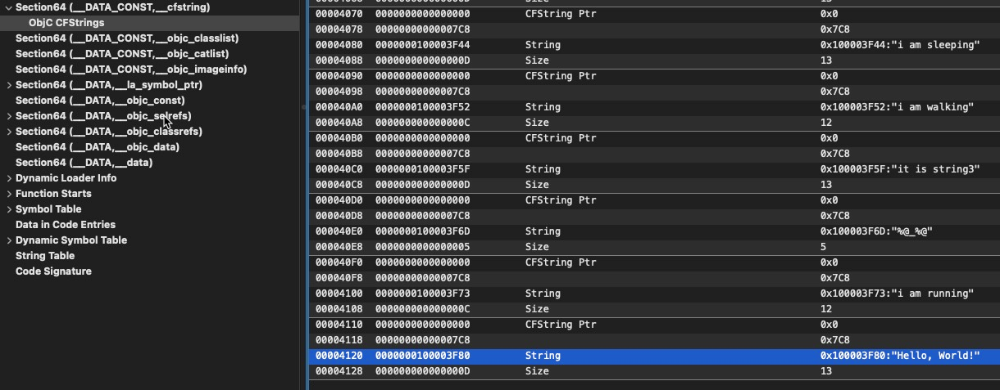

具体字符串值在 `0x3F80` 地址中，指向 **Section64(__TEXT,__cstring)**：

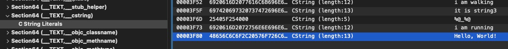

```
0000000100003e2b	callq	0x100003ea6 
```

调用 `0x3ea6` 偏移地址，指向**符号桩** **Section64(__TEXT,__stubs)** 中，我们看下存储的什么

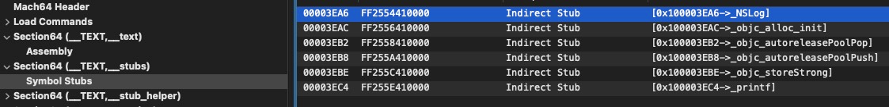

其实 `__stubs` 存储很多小段代码，我们反汇编看下：

```
➜  Debug otool -v TestMacho1 -s __TEXT __stubs
TestMacho1:
Contents of (__TEXT,__stubs) section
0000000100003ea6    jmpq    *0x4154(%rip)
0000000100003eac    jmpq    *0x4156(%rip)
0000000100003eb2    jmpq    *0x4158(%rip)
0000000100003eb8    jmpq    *0x415a(%rip)
0000000100003ebe    jmpq    *0x415c(%rip)
0000000100003ec4    jmpq    *0x415e(%rip)
```

第一条：```0000000100003ea6	jmpq	*0x4154(%rip)```

0x3eac + 0x4154 = 0x8000

而 `0x8000` 指向 **Section64(DATA,la_symbol_ptr)**:

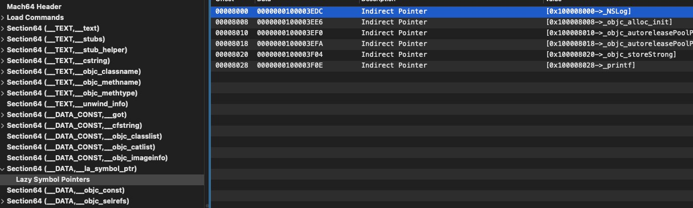

继续看 `la_symbol_ptr` 中的值指向什么地方：

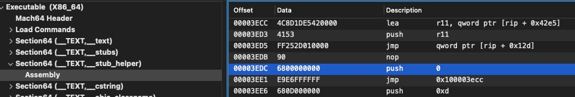

发现其指向**桩函数节** **Section64(__TEXT,__stub_helper)**，分析下其中代码，回跳到 `0x3ecc` 后又 `jump` 到 `rip+0x12d（0x4008）`

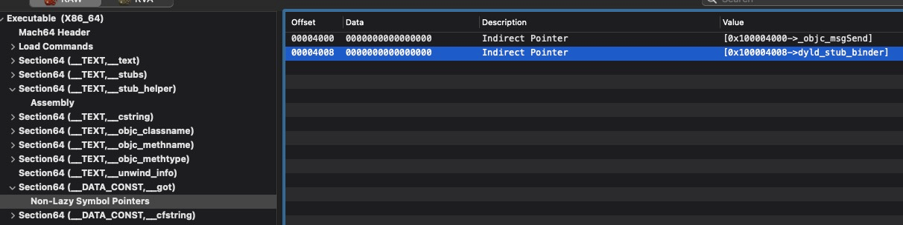

指向 `got` 表存储的 `dyld_stub_binder`，后续会走 lazy binding 逻辑，这个我们通过动态调试加以验证。可以在 `main` 函数的 `NSLog` 下断点，查看 `__la_symbol_ptr` 存储的值为桩函数代码地址，代码通过调用 `dyld_stub_binder` 找到 `NSLog` 真实地址替换 `__la_symbol_ptr` 中存储的值（由 `0x100003edc` 变为 `0x7fff214af5f3` ），下次调用 `NSLog` 即可直接找到其实现地址。和静态分析一致。

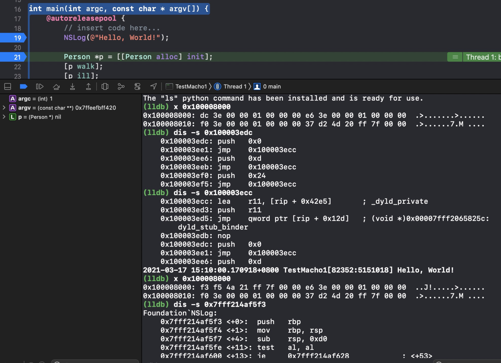

到这只完成分析 `NSLog(@"Hello, World!");` 是如何在二进制中体现的。keep going...


```
0000000100003e30	movq	0x4329(%rip), %rcx 
0000000100003e3a	callq	0x100003eac 
```

对应OC代码： `Person *p = [[Person alloc] init];`


跳转到 `_objc_alloc_init` 的过程和之前一样，不重复分析，看下是如何找到 `Person` 类名的。

`0x3e37 + 0x4329 = 0x8160`， 指向 **Section64(DATA,objc_classrefs)** 节，该节获取当前所有 oc 类和被引用的 oc 类地址

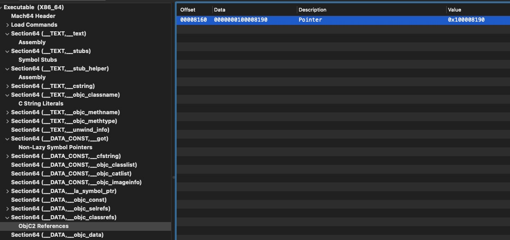

其值 `0x8190` 指向 **Section64(DATA,objc_data)**

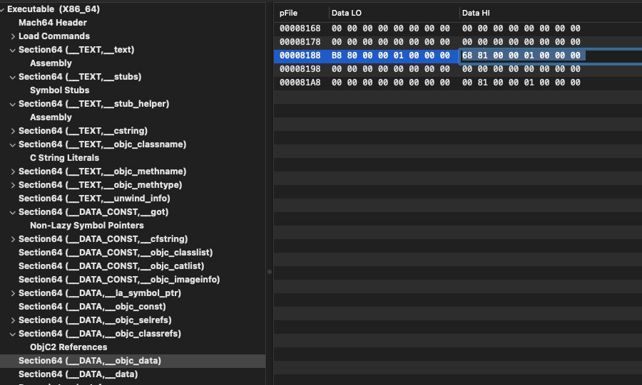

这个 `section` 存的什么数据呢，我们可以从[llvm源码](https://clang.llvm.org/doxygen/CGObjCMac_8cpp_source.html)窥探一二

```c
 /// Build the metaclass object for a class.
 ///
 /// struct _class_t {
 ///   struct _class_t *isa;
 ///   struct _class_t * const superclass;
 ///   void *cache;
 ///   IMP *vtable;
 ///   struct class_ro_t *ro;
 /// }
 ///
 llvm::GlobalVariable *
 CGObjCNonFragileABIMac::BuildClassObject(const ObjCInterfaceDecl *CI,
                                          bool isMetaclass,
                                          llvm::Constant *IsAGV,
                                          llvm::Constant *SuperClassGV,
                                          llvm::Constant *ClassRoGV,
                                          bool HiddenVisibility) {
   ConstantInitBuilder builder(CGM);
   auto values = builder.beginStruct(ObjCTypes.ClassnfABITy);
   values.add(IsAGV);
   if (SuperClassGV) {
     values.add(SuperClassGV);
   } else {
     values.addNullPointer(ObjCTypes.ClassnfABIPtrTy);
   }
   values.add(ObjCEmptyCacheVar);
   values.add(ObjCEmptyVtableVar);
   values.add(ClassRoGV);
  
   llvm::GlobalVariable *GV =
     cast<llvm::GlobalVariable>(GetClassGlobal(CI, isMetaclass, ForDefinition));
   values.finishAndSetAsInitializer(GV);
  
   if (CGM.getTriple().isOSBinFormatMachO())
     GV->setSection("__DATA, __objc_data");
   GV->setAlignment(llvm::Align(
       CGM.getDataLayout().getABITypeAlignment(ObjCTypes.ClassnfABITy)));
   if (!CGM.getTriple().isOSBinFormatCOFF())
     if (HiddenVisibility)
       GV->setVisibility(llvm::GlobalValue::HiddenVisibility);
   return GV;
 }
```

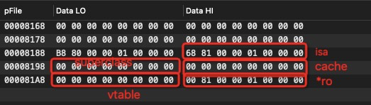

`class_ro_t` 结构体是如何定义的呢？存储了什么数据呢？我们可以通过 [Runtime源码](https://opensource.apple.com/source/objc4/objc4-437/runtime/objc-runtime-new.h) 中得到答案：

```c
typedef struct class_ro_t {
    uint32_t flags;
    uint32_t instanceStart;
    uint32_t instanceSize;
#ifdef __LP64__
    uint32_t reserved;
#endif

    const uint8_t * ivarLayout;
    
    const char * name;
    const method_list_t * baseMethods;
    const protocol_list_t * baseProtocols;
    const ivar_list_t * ivars;

    const uint8_t * weakIvarLayout;
    const struct objc_property_list *baseProperties;
} class_ro_t;

typedef struct method_list_t {
    uint32_t entsize_NEVER_USE;  // low 2 bits used for fixup markers
    uint32_t count;
    struct method_t first;
} method_list_t;

typedef struct method_t {
    SEL name;
    const char *types;
    IMP imp;
} method_t;
```

该结构体中存储了方法、协议、变量、属性列表

`0x8100` 具体指向 **Section64(__DATA,__objc_const)** 节

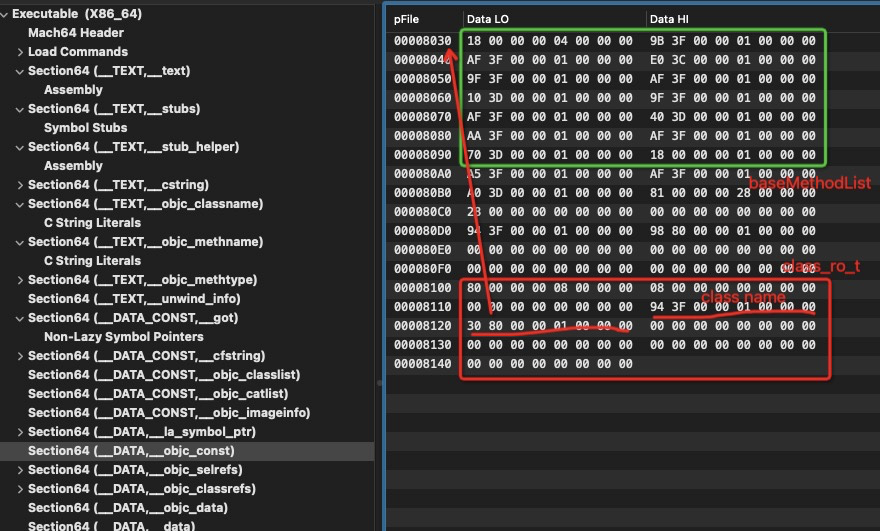

通过结构体分析我们可以知道类名存储在 **Section64(__TEXT,__objc_classname)**，为`Person`，其中包含的方法列表 `method_list_t` 结构体在地址 `0x8030` 中，通过方法结构体分析方法名有: [ill, sleep, sleep, walk]


细心发现这里有个两个同名方法 `sleep`，我们可以看下第一个 `sleep` 方法 imp 地址为 `0x3d10`，由之前 otool 反汇编的结果看是 `Person Category` 实现的 `sleep`（`-[Person(other) sleep]:`），而函数查找是按照列表顺序来的，因此可以实现函数覆盖的效果，实际原函数并没有被覆盖。


接着我们再来看下 `[p sleep]` OC方法调用：

```
0000000100003e6b	movq	-0x18(%rbp), %rax
0000000100003e6f	movq	0x42e2(%rip), %rsi 
0000000100003e79	callq	*0x181(%rip)
```

`rbp - 0x18` 存储之前 `Person` 实例化后的对象，赋值给 `rax`（参数1）

`rip + 0x42e2 = 0x8158`，指向 **Section64(__DATA,__objc_selrefs)** 节，存储的地址指向函数名为 `sleep`，赋值给 `rsi`（参数2）：

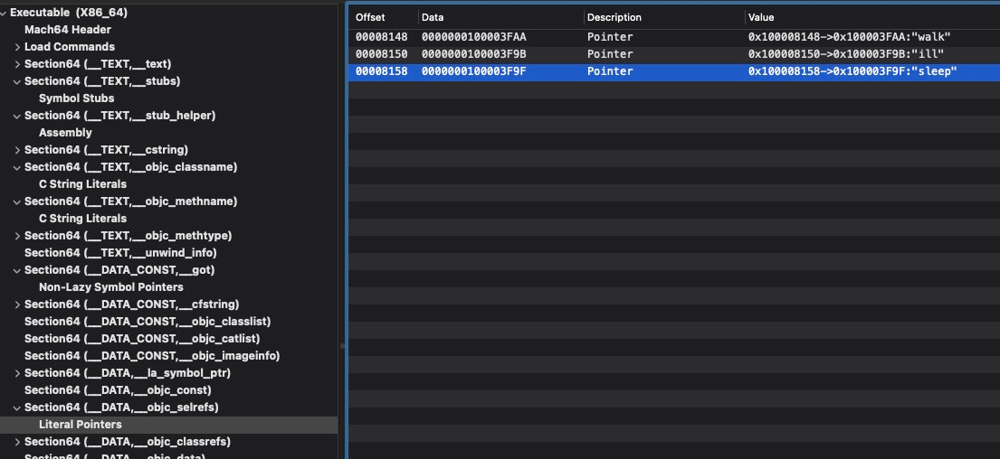

`rip + 0x181 = 0x4000`，为 `_got` 表中 `_objc_msgSend` 方法，此时就进入OC的消息转发机制，具体原理在后续章节介绍。为什么会是这种形式，我们通过编译后源码转换成C代码的样子。

clang -rewrite-objc main.m -o main.cpp

```cpp
void run() {
    NSLog((NSString *)&__NSConstantStringImpl__var_folders_16_fnqk_6_50_z264j18b83nb9w0000gp_T_main_c8b264_mi_0);
}

int main(int argc, const char * argv[]) {
    /* @autoreleasepool */ { __AtAutoreleasePool __autoreleasepool; 

        NSLog((NSString *)&__NSConstantStringImpl__var_folders_16_fnqk_6_50_z264j18b83nb9w0000gp_T_main_c8b264_mi_1);

        Person *p = ((Person *(*)(id, SEL))(void *)objc_msgSend)((id)((Person *(*)(id, SEL))(void *)objc_msgSend)((id)objc_getClass("Person"), sel_registerName("alloc")), sel_registerName("init"));
        ((void (*)(id, SEL))(void *)objc_msgSend)((id)p, sel_registerName("walk"));
        ((void (*)(id, SEL))(void *)objc_msgSend)((id)p, sel_registerName("ill"));
        ((void (*)(id, SEL))(void *)objc_msgSend)((id)p, sel_registerName("sleep"));

        run();
    }
    return 0;
}
```

可以发现，调用 OC 方法实际是通过 `objc_msgSend(id, sel)` 进行消息查找和转发。

最后我们看下 C 函数 `run()` 调用，直接通过 `call 0x100003de0` 即可跳转 `run` 实现处

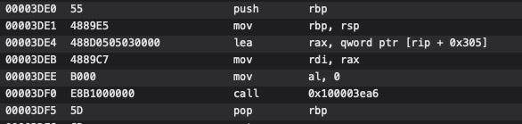

## 总结

文中分析涉及到多个 `Section`，我们在这里做个汇总

| **名称**                | **作用**                                                     |
| ----------------------- | ------------------------------------------------------------ |
| __TEXT,__text           | 可执行机器码                                                 |
| __TEXT,__stubs          | 符号桩，跳转到 `__la_symbol_ptr` 表对应地址                  |
| __TEXT,__stub_helper    | 桩函数，`la_symbol_ptr` 表中没有找到真正符号地址时，均指向这，通过 `dyld_stub_binder` 找到函数实现地址并替换 `la_symbol_pt` r表项 |
| __TEXT,__cstring        | 字符串                                                       |
| __TEXT,__objc_classname | 类名                                                         |
| __DATA,__cfstring       | 保存 Objc 字符串类型、大小、值信息                           |
| __DATA,__objc_const     | `_class_t` 中 `class_ro_t` 结构体，以及类函数列表存储在此节  |
| __DATA,__objc_selrefs   | SEL 函数名地址                                               |
| __DATA,__objc_classrefs | OC 类地址                                                    |
| __DATA,__la_symbol_ptr  | 动态链接时，延迟绑定需要，跳转到 `TEXT,stub_helper` 对应地址 |
| __DATA,__objc_data      | `_class_t` 类结构体存储在此节                                |

## 探究

1. 在 MachO 文件结构还未讲到的 `LC_SEGMENT_64(_LINKEDIT)`、`LC_SYMTAB`、`LCDYSYMTAB`、`LC_LOAD_DYLIB`、`Symbol Table`和`Dynamic Symbol Table`等作用
2. 这些段节涉及静态/动态链接原理
3. 动态链接中延迟绑定技术
4. OC方法本质/OC类对象/实例对象
5. 类结构体中isa指针
6. Runtime 机制中方法查找和消息转发机制
7. fishhook 是如何利用符号绑定技术实现动态 hook

后续我们会一一解密，敬请期待...
