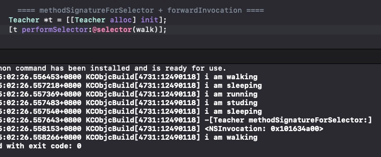

# 方法查找和消息转发


>  iOS AOP文章系列
>
>  前导知识：
>  * [Mach-O文件结构分析](https://houugen.fun/posts/mach-o%E6%96%87%E4%BB%B6%E7%BB%93%E6%9E%84%E5%88%86%E6%9E%90.html)
>  * [静态链接&动态链接](https://houugen.fun/posts/%E9%9D%99%E6%80%81%E9%93%BE%E6%8E%A5%E5%8A%A8%E6%80%81%E9%93%BE%E6%8E%A5.html)
>  * [OC方法&OC类&OC对象](https://houugen.fun/posts/oc%E6%96%B9%E6%B3%95oc%E7%B1%BBoc%E5%AF%B9%E8%B1%A1.html)
>  * [方法查找和消息转发](https://houugen.fun/posts/%E6%96%B9%E6%B3%95%E6%9F%A5%E6%89%BE%E5%92%8C%E6%B6%88%E6%81%AF%E8%BD%AC%E5%8F%91.html)
>
>  AOP框架：
>  * Method Swizzling
>  * Fishhook
>  * Apsects
>  * NSProxy AOP


**源码分析环境：objc4-818.2**


根据之前的文章我们知道OC方法的本质就是调用 `obj_msgSend`，那么我们具体分析下 ObjC 下方法的查找和转发机制。

`obj_msgSend` 的实现在 `obj-msg-rm64.s` 中的汇编代码为：

```
ENTRY _objc_msgSend
    UNWIND _objc_msgSend, NoFrame

    cmp p0, #0          // nil check and tagged pointer check
#if SUPPORT_TAGGED_POINTERS
    b.le    LNilOrTagged        //  (MSB tagged pointer looks negative)
#else
    b.eq    LReturnZero
#endif
    ldr p13, [x0]       // p13 = isa
    GetClassFromIsa_p16 p13, 1, x0  // p16 = class
LGetIsaDone:
    // calls imp or objc_msgSend_uncached
    CacheLookup NORMAL, _objc_msgSend, __objc_msgSend_uncached

#if SUPPORT_TAGGED_POINTERS
LNilOrTagged:
    b.eq    LReturnZero     // nil check
    GetTaggedClass
    b   LGetIsaDone
// SUPPORT_TAGGED_POINTERS
#endif

LReturnZero:
    // x0 is already zero
    mov x1, #0
    movi    d0, #0
    movi    d1, #0
    movi    d2, #0
    movi    d3, #0
    ret

    END_ENTRY _objc_msgSend
```

根据汇编和注释，理出其核心伪代码为：

```c
id objc_msgSend(id receiver, SEL selector, ...) {
    if (receiver == nil) return nil;
    Class cls = receiver->getIsa(); // 1
    imp = CacheLookup(receiver, selector); // 2 
    if (imp) return imp;
    // __objc_msgSend_uncached -> MethodTableLookup -> _lookUpImpOrForward
    imp = lookUpImpOrForward(receiver, selector, cls); // 3
    return imp;
}
```

## 1. 获取isa

```
ldr p13, [x0]  // p13 = isa
GetClassFromIsa_p16 p13, 1, x0  // p16 = class

==> Class cls = receiver->getIsa();
```

`GetClassFromIsa_p16` 汇编代码：

```
.macro GetClassFromIsa_p16 src, needs_auth, auth_address /* note: auth_address is not required if !needs_auth */

#if SUPPORT_INDEXED_ISA
    // Indexed isa
    mov p16, \src           // optimistically set dst = src
    tbz p16, #ISA_INDEX_IS_NPI_BIT, 1f  // done if not non-pointer isa
    // isa in p16 is indexed
    adrp    x10, _objc_indexed_classes@PAGE
    add x10, x10, _objc_indexed_classes@PAGEOFF
    ubfx    p16, p16, #ISA_INDEX_SHIFT, #ISA_INDEX_BITS  // extract index
    ldr p16, [x10, p16, UXTP #PTRSHIFT] // load class from array
1:

#elif __LP64__
.if \needs_auth == 0 // _cache_getImp takes an authed class already
    mov p16, \src
.else
    // 64-bit packed isa
    ExtractISA p16, \src, \auth_address
.endif
#else
    // 32-bit raw isa
    mov p16, \src

#endif

.endmacro
```

C语言实现版本为 `getIsa`

```c
inline Class
objc_object::getIsa() 
{
    if (fastpath(!isTaggedPointer())) return ISA();

    extern objc_class OBJC_CLASS_$___NSUnrecognizedTaggedPointer;
    uintptr_t slot, ptr = (uintptr_t)this;
    Class cls;

    slot = (ptr >> _OBJC_TAG_SLOT_SHIFT) & _OBJC_TAG_SLOT_MASK;
    cls = objc_tag_classes[slot];
    if (slowpath(cls == (Class)&OBJC_CLASS_$___NSUnrecognizedTaggedPointer)) {
        slot = (ptr >> _OBJC_TAG_EXT_SLOT_SHIFT) & _OBJC_TAG_EXT_SLOT_MASK;
        cls = objc_tag_ext_classes[slot];
    }
    return cls;
}
```

## 2. 缓存查找

```
CacheLookup NORMAL

==> imp = CacheLookup(receiver, selector);
```

`CacheLookup` 包含三种模式 `NORMAL` / `LOOKUP` / `GETIMP`

其具体汇编逻辑就是在 `objc_class` 类结构体中获取 `cache_t` 的 `buckets`，循环比较要查找的方法名是否在缓存列表 `buckets` 中，找到返回 `imp`，没有找到则调用 `__objc_msgSend_uncached`（具体数据结构在[OC方法&OC类&OC对象](https://houugen.fun/posts/oc%E6%96%B9%E6%B3%95oc%E7%B1%BBoc%E5%AF%B9%E8%B1%A1.html)中查看）

```
STATIC_ENTRY __objc_msgSend_uncached
UNWIND __objc_msgSend_uncached, FrameWithNoSaves

// THIS IS NOT A CALLABLE C FUNCTION
// Out-of-band p15 is the class to search

MethodTableLookup
TailCallFunctionPointer x17

END_ENTRY __objc_msgSend_uncached
```

`MethodTableLookup`：

```
.macro MethodTableLookup
    
    SAVE_REGS MSGSEND

    // lookUpImpOrForward(obj, sel, cls, LOOKUP_INITIALIZE | LOOKUP_RESOLVER)
    // receiver and selector already in x0 and x1
    mov x2, x16
    mov x3, #3
    bl  _lookUpImpOrForward

    // IMP in x0
    mov x17, x0

    RESTORE_REGS MSGSEND

.endmacro
```

## 3. 方法查找流程

而 `lookUpImpOrForward` 使用C函数实现：

```c
NEVER_INLINE
IMP lookUpImpOrForward(id inst, SEL sel, Class cls, int behavior)
{
    const IMP forward_imp = (IMP)_objc_msgForward_impcache;
    IMP imp = nil;
    Class curClass;

    runtimeLock.assertUnlocked();

    if (slowpath(!cls->isInitialized())) {
        // The first message sent to a class is often +new or +alloc, or +self
        // which goes through objc_opt_* or various optimized entry points.
        //
        // However, the class isn't realized/initialized yet at this point,
        // and the optimized entry points fall down through objc_msgSend,
        // which ends up here.
        //
        // We really want to avoid caching these, as it can cause IMP caches
        // to be made with a single entry forever.
        //
        // Note that this check is racy as several threads might try to
        // message a given class for the first time at the same time,
        // in which case we might cache anyway.
        behavior |= LOOKUP_NOCACHE;
    }

    // runtimeLock is held during isRealized and isInitialized checking
    // to prevent races against concurrent realization.

    // runtimeLock is held during method search to make
    // method-lookup + cache-fill atomic with respect to method addition.
    // Otherwise, a category could be added but ignored indefinitely because
    // the cache was re-filled with the old value after the cache flush on
    // behalf of the category.

    runtimeLock.lock();

    // We don't want people to be able to craft a binary blob that looks like
    // a class but really isn't one and do a CFI attack.
    //
    // To make these harder we want to make sure this is a class that was
    // either built into the binary or legitimately registered through
    // objc_duplicateClass, objc_initializeClassPair or objc_allocateClassPair.
    checkIsKnownClass(cls);

    cls = realizeAndInitializeIfNeeded_locked(inst, cls, behavior & LOOKUP_INITIALIZE);
    // runtimeLock may have been dropped but is now locked again
    runtimeLock.assertLocked();
    curClass = cls;

    // The code used to lookup the class's cache again right after
    // we take the lock but for the vast majority of the cases
    // evidence shows this is a miss most of the time, hence a time loss.
    //
    // The only codepath calling into this without having performed some
    // kind of cache lookup is class_getInstanceMethod().

    for (unsigned attempts = unreasonableClassCount();;) {
        if (curClass->cache.isConstantOptimizedCache(/* strict */true)) {
#if CONFIG_USE_PREOPT_CACHES
            imp = cache_getImp(curClass, sel);
            if (imp) goto done_unlock;
            curClass = curClass->cache.preoptFallbackClass();
#endif
        } else {
            // curClass method list.
            Method meth = getMethodNoSuper_nolock(curClass, sel);
            if (meth) {
                imp = meth->imp(false);
                goto done;
            }

            if (slowpath((curClass = curClass->getSuperclass()) == nil)) {
                // No implementation found, and method resolver didn't help.
                // Use forwarding.
                imp = forward_imp;
                break;
            }
        }

        // Halt if there is a cycle in the superclass chain.
        if (slowpath(--attempts == 0)) {
            _objc_fatal("Memory corruption in class list.");
        }

        // Superclass cache.
        imp = cache_getImp(curClass, sel);
        if (slowpath(imp == forward_imp)) {
            // Found a forward:: entry in a superclass.
            // Stop searching, but don't cache yet; call method
            // resolver for this class first.
            break;
        }
        if (fastpath(imp)) {
            // Found the method in a superclass. Cache it in this class.
            goto done;
        }
    }

    // No implementation found. Try method resolver once.

    if (slowpath(behavior & LOOKUP_RESOLVER)) {
        behavior ^= LOOKUP_RESOLVER;
        return resolveMethod_locked(inst, sel, cls, behavior);
    }

 done:
    if (fastpath((behavior & LOOKUP_NOCACHE) == 0)) {
#if CONFIG_USE_PREOPT_CACHES
        while (cls->cache.isConstantOptimizedCache(/* strict */true)) {
            cls = cls->cache.preoptFallbackClass();
        }
#endif
        log_and_fill_cache(cls, imp, sel, inst, curClass);
    }
 done_unlock:
    runtimeLock.unlock();
    if (slowpath((behavior & LOOKUP_NIL) && imp == forward_imp)) {
        return nil;
    }
    return imp;
}
```

这是 `objc-runtime-new.mm` 中源码，其实可以结合 `objc-runtime-old.mm` 能更清晰的理出其逻辑：

- 初始化
- 本类缓存查找

- - 找到返回 `IMP`

- 本类方法列表查找

- - 找到返回 IMP

- 循环父类链在父类缓存和方法列表查找

- - 找到记录进缓存
  - 获取 `IMP`返回

- 动态方法解析

- - 实例方法解析
  - 类方法解析

- 重新进行一边方法查找流程
- 消息转发

### 3.1 查找本类

```c
// 查找本类缓存
if (curClass->cache.isConstantOptimizedCache(/* strict */true)) {
    imp = cache_getImp(curClass, sel);
    if (imp) goto done_unlock;
    ...
    #endif
} else {
// 查找本类方法列表
    // curClass method list.
    Method meth = getMethodNoSuper_nolock(curClass, sel);
    if (meth) {
        imp = meth->imp(false);
        goto done;
    }
```

### 3.2 查找父类

```c
// Superclass cache.
imp = cache_getImp(curClass, sel);
if (slowpath(imp == forward_imp)) {
    // Found a forward:: entry in a superclass.
    // Stop searching, but don't cache yet; call method
    // resolver for this class first.
    break;
}
if (fastpath(imp)) {
    // Found the method in a superclass. Cache it in this class.
    goto done;
}
```

其中 `slowpath` 和 `fastpath` 是两个宏定义，其主要作用是告诉编译 `if` 中是大概率还是小概率事件从而优化代码

```c
// x 大概率是1
#define fastpath(x) (__builtin_expect(bool(x), 1))
// x 大概率是0
#define slowpath(x) (__builtin_expect(bool(x), 0))
```

所以 `slowpath(imp == forward_imp)` 就是大概率 `imp` 不等于 `forward_imp`

`fastpath(imp)` 是 `imp` 大概率存在

### 3.3 动态方法解析

```objective-c
// No implementation found. Try method resolver once.
if (slowpath(behavior & LOOKUP_RESOLVER)) {
    behavior ^= LOOKUP_RESOLVER;
    return resolveMethod_locked(inst, sel, cls, behavior);
}
static NEVER_INLINE IMP
resolveMethod_locked(id inst, SEL sel, Class cls, int behavior)
{
    ...
    if (! cls->isMetaClass()) {
        // try [cls resolveInstanceMethod:sel]
        resolveInstanceMethod(inst, sel, cls);
    } 
    else {
        // try [nonMetaClass resolveClassMethod:sel]
        // and [cls resolveInstanceMethod:sel]
        resolveClassMethod(inst, sel, cls);
        if (!lookUpImpOrNilTryCache(inst, sel, cls)) {
            resolveInstanceMethod(inst, sel, cls);
        }
    }
    ...
}
```

`resolveMethod_locked` 的逻辑是如果本类是元类，调用 `resolveInstanceMethod`；如果不是说明方法是实例方法，调用 `resolveClassMethod`。

```c
static void resolveInstanceMethod(id inst, SEL sel, Class cls)
{
    ...
    SEL resolve_sel = @selector(resolveInstanceMethod:);
    BOOL (*msg)(Class, SEL, SEL) = (typeof(msg))objc_msgSend;
    bool resolved = msg(cls, resolve_sel, sel);

    // Cache the result (good or bad) so the resolver doesn't fire next time.
    // +resolveInstanceMethod adds to self a.k.a. cls
    IMP imp = lookUpImpOrNilTryCache(inst, sel, cls);
    ...
}
```

发送调用 `resolveInstanceMethod:` 解析器方法（在 `NSObjcet` 中已实现），该解析器方法动态为实例方法的 `SEL` 提供 `IMP`，如果找到方法并添加到 `receiver` 中返回 `true`。**解析成功需要重新进行方法查找以保障返回 IMP。**

### 3.4 重新执行查找流程

```objective-c
static NEVER_INLINE IMP
resolveMethod_locked(id inst, SEL sel, Class cls, int behavior)
{
    ...
    // chances are that calling the resolver have populated the cache
    // so attempt using it
    return lookUpImpOrForwardTryCache(inst, sel, cls, behavior);
}

IMP lookUpImpOrForwardTryCache(id inst, SEL sel, Class cls, int behavior)
{
    return _lookUpImpTryCache(inst, sel, cls, behavior);
}

static IMP _lookUpImpTryCache(id inst, SEL sel, Class cls, int behavior)
{
    ...
    if (slowpath(imp == NULL)) {
        return lookUpImpOrForward(inst, sel, cls, behavior);
    }
    ...
}
```

最终会再执行 `lookUpImpOrForward` 重走查找流程。

### 3.5 消息转发

如果以上流程都没有找到方法 `IMP`，则进入消息转发流程，这个流程又进入到汇编代码中

```objective-c
const IMP forward_imp = (IMP)_objc_msgForward_impcache;
// No implementation found, and method resolver didn't help.
// Use forwarding.
imp = forward_imp;
```

## 4. 消息转发分析

```
/********************************************************************
*
* id _objc_msgForward(id self, SEL _cmd,...);
*
* _objc_msgForward is the externally-callable
*   function returned by things like method_getImplementation().
* _objc_msgForward_impcache is the function pointer actually stored in
*   method caches.
*
********************************************************************/

    STATIC_ENTRY __objc_msgForward_impcache

    // No stret specialization.
    b   __objc_msgForward

    END_ENTRY __objc_msgForward_impcache

    
    ENTRY __objc_msgForward

    adrp    x17, __objc_forward_handler@PAGE
    ldr p17, [x17, __objc_forward_handler@PAGEOFF]
    TailCallFunctionPointer x17
    
    END_ENTRY __objc_msgForward
void *_objc_forward_handler = (void*)objc_defaultForwardHandler;
```

这里其实跟不下去了，查阅资料发现这里有个小技巧，可以通过 `instrumentObjcMessageSends` 打开 `log`，并且会保存在 `/tmp/msgSends-%d` 路径文件中，我们在 `Demo` 中添加代码：



查看日志文件：

```
Student Student resolveInstanceMethod:
Student Student resolveInstanceMethod:
Student NSObject forwardingTargetForSelector:
Student NSObject forwardingTargetForSelector:
Student Student methodSignatureForSelector:
Student Student methodSignatureForSelector:
```

### 4.1 forwardingTargetForSelector

```objective-c
+ (id)forwardingTargetForSelector:(SEL)sel {
    return nil;
}

- (id)forwardingTargetForSelector:(SEL)sel {
    return nil;
}
```

我们看下[官方接口描述](https://developer.apple.com/documentation/objectivec/nsobject/1418855-forwardingtargetforselector?language=objc)：


If an object implements (or inherits) this method, and returns a non-`nil` (and non-`self`) result, that returned object is used as the new receiver object and the message dispatch resumes to that new object. (Obviously if you return `self` from this method, the code would just fall into an infinite loop.)

If you implement this method in a non-root class, if your class has nothing to return for the given selector then you should return the result of invoking super’s implementation.

This method gives an object a chance to redirect an unknown message sent to it before the much more expensive [`forwardInvocation:`](https://developer.apple.com/documentation/objectivec/nsobject/1571955-forwardinvocation?language=objc) machinery takes over. This is useful when you simply want to redirect messages to another object and can be an order of magnitude faster than regular forwarding. It is not useful where the goal of the forwarding is to capture the NSInvocation, or manipulate the arguments or return value during the forwarding.

“当您只想将消息重定向到另一个对象，并且比常规转发快一个数量级时，此功能很有用”



来研究下如何使用，我们创建一个 `Teacher` 类，但不继承 `Person`，那我们想让 `Teacher` 调用 `Person` 的 `sleep` 方法，通过快速转发应该如何实现：

```objective-c
// Teacher.m
@implementation Teacher

- (void)teach {
    NSLog(@"I am teaching");
}

- (id)forwardingTargetForSelector:(SEL)aSelector {
    NSLog(@"%s", __func__);
    Person *p = [[Person alloc] init];
    if ([p respondsToSelector: aSelector]) {
        return p;
    }
    return [super forwardingTargetForSelector: aSelector];
}

@end

// main.m 中即可实现 Teacher 调用 sleep
 Teacher *t = [[Teacher alloc] init];
 [t performSelector:@selector(sleep)];
```



### 4.2 methodSignatureForSelector

也没有具体实现，同样看下文档


This method is used in the implementation of protocols. This method is also used in situations where an `NSInvocation` object must be created, such as during message forwarding. If your object maintains a delegate or is capable of handling messages that it does not directly implement, you should override this method to return an appropriate method signature.

“用于 `NSInvocation` 必须创建对象的情况下，例如在消息转发期间”



接着会调用 `forwardInvocation:` 方法进行消息转发。

同样，我们想实现 `forwardingTargetForSelector` 中展示的那种能力，看看利用 `methodSignatureForSelector` + `forwardInvocation` 如何code.

我们继续在 `Teacher` 类中施加魔法：

```objective-c
// Teacher.m
@implementation Teacher

- (NSMethodSignature *)methodSignatureForSelector:(SEL)aSelector {
    NSLog(@"%s", __func__);
    if (aSelector == @selector(walk)) {
        // 获取 SEL 方法签名
        NSMethodSignature *sig = [[Person new] methodSignatureForSelector:aSelector];
        return sig;
    }
    return [super methodSignatureForSelector:aSelector];
}

- (void)forwardInvocation:(NSInvocation *)anInvocation {
    NSLog(@"%@", anInvocation);
    // 获取 SEL 消息
    SEL s = [anInvocation selector];
    // 实例化 Person 类
    Person *p = [[Person alloc] init];
    // 向接收对象 p 发送 SEL 消息
    if ([p respondsToSelector:s]) {
        [anInvocation invokeWithTarget:p];
    } else {
        [super forwardInvocation:anInvocation];
    }
}

@end

// main.m 中实现 Teacher 调用 walk
// methodSignatureForSelector + forwardInvocation
[t performSelector:@selector(walk)];
```


请注释掉4.1中的 `- (id)forwardingTargetForSelector:(SEL)aSelector` 实现，否则会优先执行快速转发机制而不会走到 `methodSignatureForSelector` 中。




这个消息转发原理我们后续会在一些经典的 `AOP` 框架分析中看到其利用。

## 总结

整个流程包括 缓存查找 -> 本类父类方法查找 -> 动态方法解析 -> 快速消息转发 -> 慢速消息转发。而其中**动态方法解析**、**快速消息转发**和**慢速消息转发**就是 🍎 给的额外三次寻找 `IMP` 的机会。

至此 `obj_msgSend` 的整个流程梳理完毕，其中很多细节建议读者自己去阅读探寻。
