# 静态链接&动态链接


>  iOS AOP文章系列
>
>  前导知识：
>  * [Mach-O文件结构分析](https://houugen.fun/posts/mach-o%E6%96%87%E4%BB%B6%E7%BB%93%E6%9E%84%E5%88%86%E6%9E%90.html)
>  * [静态链接&动态链接](https://houugen.fun/posts/%E9%9D%99%E6%80%81%E9%93%BE%E6%8E%A5%E5%8A%A8%E6%80%81%E9%93%BE%E6%8E%A5.html)
>  * OC方法&OC类&OC对象
>  * 方法查找和消息转发
>
>  AOP框架：
>  * Method Swizzling
>  * Fishhook
>  * Apsects
>  * NSProxy AOP

## 静态链接

还是通过 🌰 来分析：

```shell
➜  ios cat bar.c
int global = 1;
void fizz(int a) {
    global = a;
}
➜  ios cat main.c
extern int global;
void fizz(int a);
int main() {
    fizz(100 + global);
    return 0;
}
```

编译链接 `bar.c` 和 `main.c` 生成可执行文件 `main`

```shell
➜  ios xcrun -sdk iphoneos clang -c bar.c main.c -target arm64-apple-ios13.4
➜  ios xcrun -sdk iphoneos clang bar.o main.o -o main -target arm64-apple-ios13.4
```

我们看下链接前后符号表的变化：

```shell
➜  ios jtool -S bar.o
0000000000000000 T _fizz
0000000000000020 D _global
➜  ios jtool -S main.o
0000000000000000 T _main
                 U _fizz
                 U _global
➜  ios jtool -S main
0000000100000000 T __mh_execute_header
0000000100007f54 T _fizz
0000000100008000 D _global
0000000100007f74 T _main
                 U dyld_stub_binder
```

在链接前 `bar.o` 中 `fizz` 和 `global` 符号地址为临时地址，`main.o` 中 `main` 符号为临时地址，`fizz` 和 `global` 符号未定义，静态链接为可执行文件 `main` 后，发现各符号都有了对应地址，这中间发生了什么呢？

其中关键就是**符号的解析**和**重定位**。

用 MachOView 查看 `main.o` 文件：

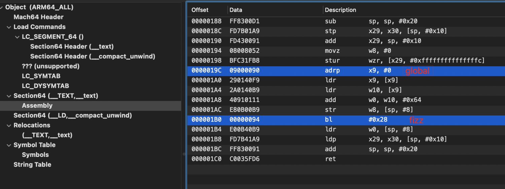

代码中符号的位置用 `global` 和 `fizz` 暂时用`0x0`和`0x2c`替代，链接器在完成地址空间分配后，就可以确定符号的虚拟地址了，链接器根据符号地址对每个需要重定位的指令进行地址修正，通过 `_text` 头中可以看到需要重定位的有三处以及重定位表偏移（488 = 0x1E8）。

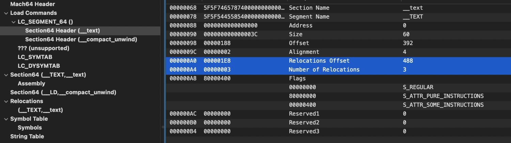

而具体重定位信息在重定位表 `Relocations` 中：

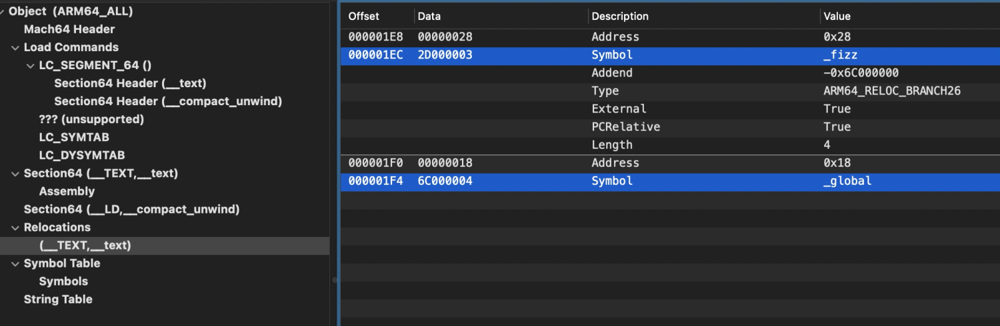

重定位表结构为：

```
struct relocation_info {
   int32_t  r_address;  /* offset in the section to what is being
                   relocated */
   uint32_t     r_symbolnum:24, /* symbol index if r_extern == 1 or section
                   ordinal if r_extern == 0 */
        r_pcrel:1,  /* was relocated pc relative already */
        r_length:2, /* 0=byte, 1=word, 2=long, 3=quad */
        r_extern:1, /* does not include value of sym referenced */
        r_type:4;   /* if not 0, machine specific relocation type */
};
```

其 `r_symbolnum` 具体为 `Symbol` 符号表中 `index`

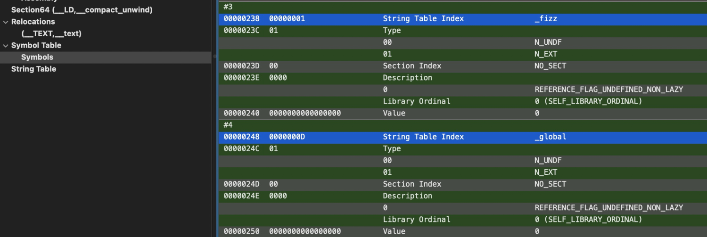

符号表是一个数组，元素结构为 `nlist_64`：

```
struct nlist_64 {
    union {
        uint32_t n_strx;   /* index into the string table */
    } n_un;
    uint8_t  n_type;       /* type flag, see below */
    uint8_t  n_sect;       /* section number or NO_SECT */
    uint16_t n_desc;       /* see <mach-o/stab.h> */
    uint64_t n_value;      /* value of this symbol (or stab offset) */
};
```

链接后（`main`）的符号表，其 `n_value` 已经替换为真实地址：

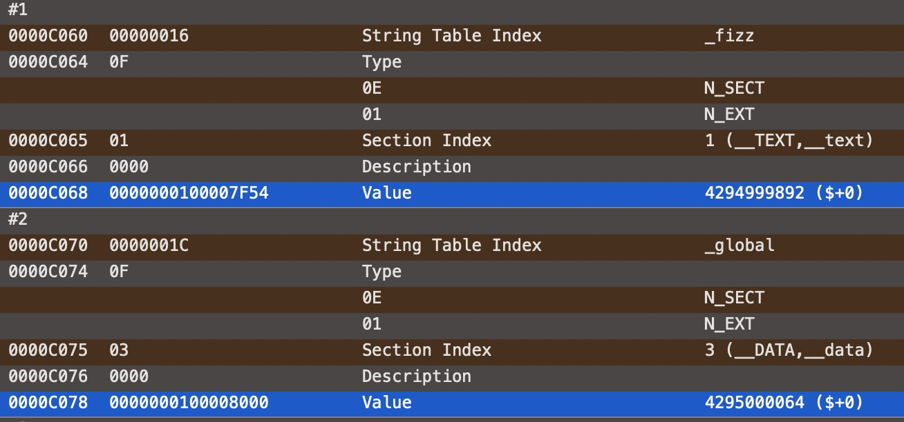

## 动态链接

静态链接是**运行前**就用 `ld` 链接器链接成一个完整的程序，而动态链接是程序主模块被加载时候，通过 `dyld` 加载命令，把 `dylib` 加载到内存，然后将程序中所有未决议的符号绑定到相应的 `dylib` 中，并进行重定位工作。

动态链接器加载命令 `LC_LOAD_DYLINKER`：

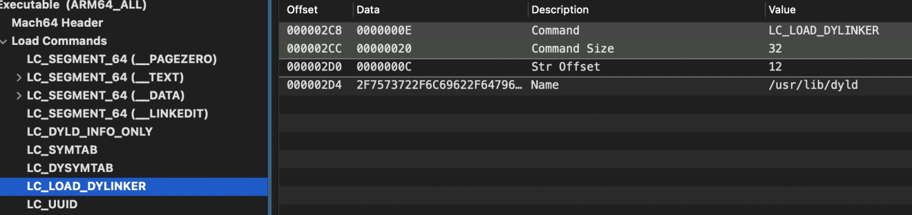

动态链接库加载命令 `LC_LOAD_DYLIB`：

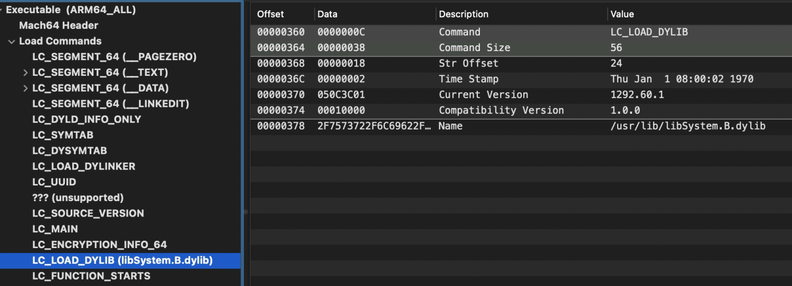

还是用之前的 🌰 ，但是我们通过动态链接库生成可执行文件 `main_dyld`

```sh
➜  ios xcrun -sdk iphoneos clang -c main.c -o main_dyld.o -target arm64-apple-ios13.4
➜  ios xcrun -sdk iphoneos clang -fPIC -shared bar.c -o libbar.dylib -target arm64-apple-ios13.4
➜  ios xcrun -sdk iphoneos clang main_dyld.o -o main_dyld -L . -l bar -target arm64-apple-ios13.4
```

我们查看 `main_dyld` 的符号表，发现并没有真实地址，但是标记了该符号来自动态库 `libbar.dylib`：

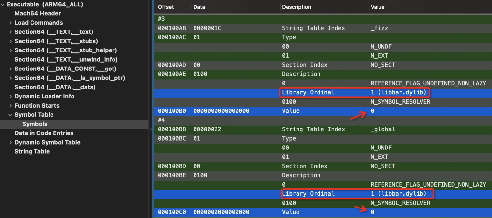

我们跟踪 `_TEXT,__text` 看下 `global` 变量 和 `fizz` 函数是如何重定位的

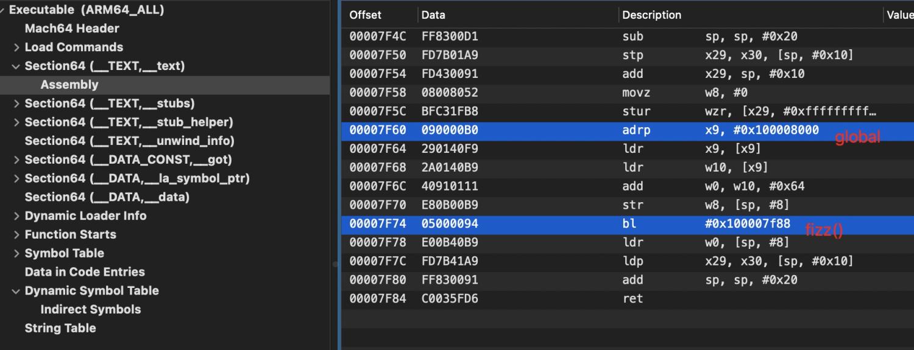

`global` 是通过 `adrp` 和 `ldr` 指令间接寻址，取`0x100008000`里面的值，而这个地址指向的 `got`(也称 `Non-Lazy Symbol Pointers` ) 表中：

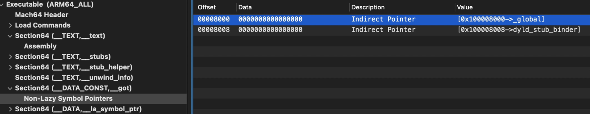

在程序装载过程中，会重定位 `got` 表中地址，但是如何知道这是什么符号？以及这个符号来自哪里？

这就需要用到 **Section64 Header(__got)** 中的 `reserved1` 字段，它代表在间接符号表（`Indirect Symbols`）中的 `index`

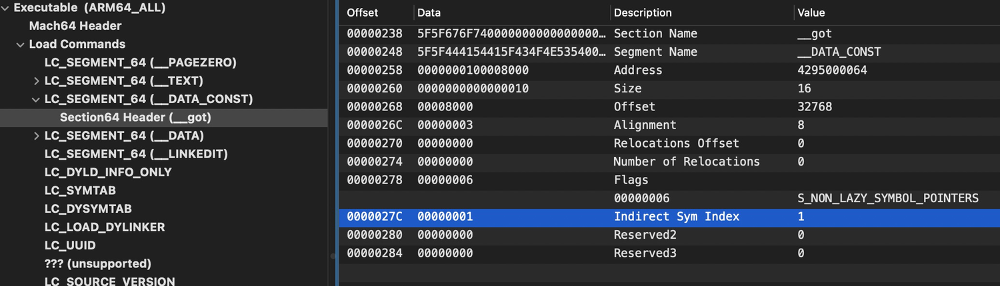

而间接符号表本身存的是符号表中的 `index`，可以看到 index=1 的项值为4，代表符号表中 index=4 的项

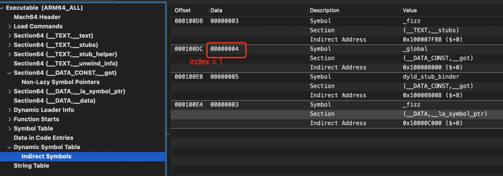

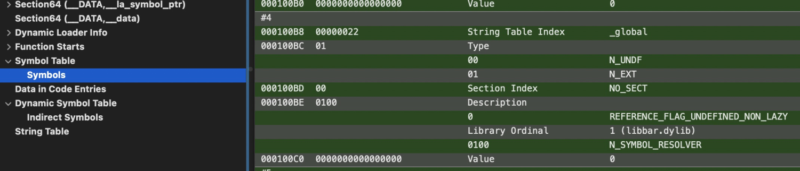

22代表在 `String Table` 中偏移22的字符串，即为 `_global`，并且描述 `_global` 来自 `libbar.dylib` 动态库，解决了上述两个问题，现在可以重定位 `got` 表中第一个符号地址。


在看下 `fizz` 函数的重定位过程

`bl #0x100007f88`

指向 `_stubs` 符号桩中

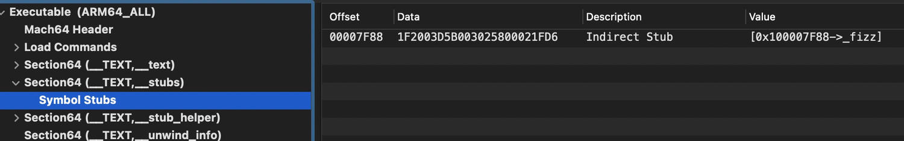

```shell
➜  ios otool -v main_dyld -s __TEXT __stubs
main_dyld:
Contents of (__TEXT,__stubs) section
0000000100007f88    nop
0000000100007f8c    ldr x16, #0x4074            ; Latency: 4
0000000100007f90    br  x16
```

0x7f8c + 0x4074 = 0xc000

指向 `__la_symbol_str` 数据段

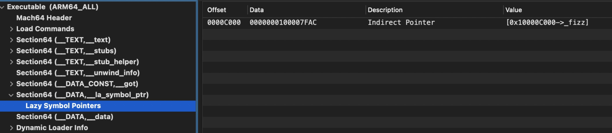

同样我们根据 **Section64 Header(la_symbol_str)** 中的 `reserverd1` 能够知道其符号名为 `_fizz`，而该函数的具体实现指向了 `0x7fac` （`stub_helper` 桩代码段)

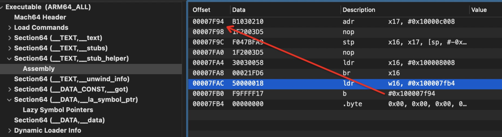

通过 `b #0x100007f94` 跳到节头地址，然后走到 `br x16` ，`x16` 为存储 `0x1000080008` 在的 `dyld_stub_binder` 函数

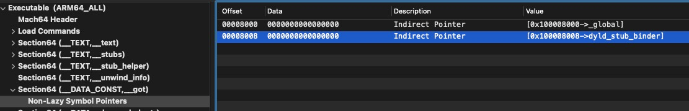

这个我们在[Mach-O文件结构分](https://houugen.fun/posts/mach-o%E6%96%87%E4%BB%B6%E7%BB%93%E6%9E%84%E5%88%86%E6%9E%90.html)析中已经讲过，是一个延迟绑定的过程，第一次调用外部函数，会调用 `dyld_stub_binder` 函数去寻址函数地址，然后写入 `__la_symbol_str` 段，之后再调同样的函数就会直接访问函数实现地址。我们看下 `dyld_stub_binder` 具体[源码](https://opensource.apple.com/source/dyld/dyld-195.5/src/dyld_stub_binder.s)实现：

```
#if __arm__
 /*    
 * sp+4 lazy binding info offset
 * sp+0 address of ImageLoader cache
 */
  
    .text
    .align 2
    .globl  dyld_stub_binder
dyld_stub_binder:
    stmfd   sp!, {r0,r1,r2,r3,r7,lr}    // save registers
    add r7, sp, #16         // point FP to previous FP

    ldr r0, [sp, #24]           // move address ImageLoader cache to 1st parameter
    ldr r1, [sp, #28]           // move lazy info offset 2nd parameter

    // call dyld::fastBindLazySymbol(loadercache, lazyinfo)
    bl  __Z21_dyld_fast_stub_entryPvl
    mov ip, r0              // move the symbol`s address into ip

    ldmfd   sp!, {r0,r1,r2,r3,r7,lr}    // restore registers
    add sp, sp, #8          // remove meta-parameters

    bx  ip              // jump to the symbol`s address that was bound

#endif /* __arm__ */
```

调用 `fastBindLazySymbol` 函数，该函数也可以在 [git](https://github.com/opensource-apple/dyld/blob/master/src/dyld.cpp) 上找到：

```c++
uintptr_t fastBindLazySymbol(ImageLoader** imageLoaderCache, uintptr_t lazyBindingInfoOffset)
{
    uintptr_t result = 0;
    // get image 
    if ( *imageLoaderCache == NULL ) {
        // save in cache
        *imageLoaderCache = dyld::findMappedRange((uintptr_t)imageLoaderCache);
        if ( *imageLoaderCache == NULL ) {
            const char* message = "fast lazy binding from unknown image";
            dyld::log("dyld: %s\n", message);
            halt(message);
        }
    }
    
    // bind lazy pointer and return it
    try {
        result = (*imageLoaderCache)->doBindFastLazySymbol((uint32_t)lazyBindingInfoOffset, gLinkContext, 
                                (dyld::gLibSystemHelpers != NULL) ? dyld::gLibSystemHelpers->acquireGlobalDyldLock : NULL,
                                (dyld::gLibSystemHelpers != NULL) ? dyld::gLibSystemHelpers->releaseGlobalDyldLock : NULL);
    }
    catch (const char* message) {
        dyld::log("dyld: lazy symbol binding failed: %s\n", message);
        halt(message);
    }

    // return target address to glue which jumps to it with real parameters restored
    return result;
}
```

真正进行符号绑定的操作在 `doBindFastLazySymbol` 中：

```c++
uintptr_t ImageLoaderMachOCompressed::doBindFastLazySymbol(uint32_t lazyBindingInfoOffset, const LinkContext& context,
                                                            void (*lock)(), void (*unlock)())
{
    // <rdar://problem/8663923> race condition with flat-namespace lazy binding
    if ( this->usesTwoLevelNameSpace() ) {
        // two-level namespace lookup does not require lock because dependents can't be unloaded before this image
    }
    else {
        // acquire dyld global lock
        if ( lock != NULL )
            lock();
    }
    
    const uint8_t* const start = fLinkEditBase + fDyldInfo->lazy_bind_off;
    const uint8_t* const end = &start[fDyldInfo->lazy_bind_size];
    if ( lazyBindingInfoOffset > fDyldInfo->lazy_bind_size ) {
        dyld::throwf("fast lazy bind offset out of range (%u, max=%u) in image %s", 
            lazyBindingInfoOffset, fDyldInfo->lazy_bind_size, this->getPath());
    }

    uint8_t type = BIND_TYPE_POINTER;
    uintptr_t address = 0;
    const char* symbolName = NULL;
    uint8_t symboFlags = 0;
    long libraryOrdinal = 0;
    bool done = false;
    uintptr_t result = 0;
    const uint8_t* p = &start[lazyBindingInfoOffset];
    while ( !done && (p < end) ) {
        uint8_t immediate = *p & BIND_IMMEDIATE_MASK;
        uint8_t opcode = *p & BIND_OPCODE_MASK;
        ++p;
        switch (opcode) {
            case BIND_OPCODE_DONE:
                done = true;
                break;
            case BIND_OPCODE_SET_DYLIB_ORDINAL_IMM:
                libraryOrdinal = immediate;
                break;
            case BIND_OPCODE_SET_DYLIB_ORDINAL_ULEB:
                libraryOrdinal = read_uleb128(p, end);
                break;
            case BIND_OPCODE_SET_DYLIB_SPECIAL_IMM:
                // the special ordinals are negative numbers
                if ( immediate == 0 )
                    libraryOrdinal = 0;
                else {
                    int8_t signExtended = BIND_OPCODE_MASK | immediate;
                    libraryOrdinal = signExtended;
                }
                break;
            case BIND_OPCODE_SET_SYMBOL_TRAILING_FLAGS_IMM:
                symbolName = (char*)p;
                symboFlags = immediate;
                while (*p != '\0')
                    ++p;
                ++p;
                break;
            case BIND_OPCODE_SET_TYPE_IMM:
                type = immediate;
                break;
            case BIND_OPCODE_SET_SEGMENT_AND_OFFSET_ULEB:
                if ( immediate >= fSegmentsCount )
                    dyld::throwf("BIND_OPCODE_SET_SEGMENT_AND_OFFSET_ULEB has segment %d which is too large (0..%d)", 
                            immediate, fSegmentsCount-1);
                address = segActualLoadAddress(immediate) + read_uleb128(p, end);
                break;
            case BIND_OPCODE_DO_BIND:
                
            
                result = this->bindAt(context, address, type, symbolName, 0, 0, libraryOrdinal, "lazy ", NULL, true);
                break;
            case BIND_OPCODE_SET_ADDEND_SLEB:
            case BIND_OPCODE_ADD_ADDR_ULEB:
            case BIND_OPCODE_DO_BIND_ADD_ADDR_ULEB:
            case BIND_OPCODE_DO_BIND_ADD_ADDR_IMM_SCALED:
            case BIND_OPCODE_DO_BIND_ULEB_TIMES_SKIPPING_ULEB:
            default:
                dyld::throwf("bad lazy bind opcode %d", *p);
        }
    }   
    
    if ( !this->usesTwoLevelNameSpace() ) {
        // release dyld global lock
        if ( unlock != NULL )
            unlock();
    }
    return result;
}
```

这里通过 `__LINKEDIT` 段的基地址 + `Lazy Binding Info` 偏移（`LC_DYLD_INFO_ONLY` 加载命令中）计算 `Lazy Binding Info` 地址



并通过函数在表偏移定位具体函数信息，看到 _fizz 是在 `libbar.dylib` 动态库中，待改写的区域为 `__DATA.__la_symbol_str`



最后调用 `bindAt` 方法通过符号名在目标库中获取函数真实地址，并调用 `bindLocation` 方法改写 `__la_symbol_str` 中指向。

```c++
uintptr_t ImageLoaderMachOCompressed::bindAt(const LinkContext& context, uintptr_t addr, uint8_t type, const char* symbolName, 
                                uint8_t symboFlags, intptr_t addend, long libraryOrdinal, const char* msg, 
                                LastLookup* last, bool runResolver)
{
    const ImageLoader*  targetImage;
    uintptr_t           symbolAddress;
    
    // resolve symbol
    symbolAddress = this->resolve(context, symbolName, symboFlags, libraryOrdinal, &targetImage, last, runResolver);

    // do actual update
    return this->bindLocation(context, addr, symbolAddress, targetImage, type, symbolName, addend, msg);
}
```


动态链接的过程就结束了，这其中涉及到几个关键原理和概念：

- 相对寻址和间接寻址
- `PIC`原理
- 延迟绑定
- `got` 和 `la_symbol_ptr`
- `dyld` 动态链接

### PIC原理

上述 `global` 和 `fizz` 两个符号是在动态库中，而动态库是可以被多个进程共享的，而动态库编译时不知道自己在进程中的虚拟内存地址，因此动态库中不能包含绝对地址，那动态库如何将代码段做到与位置无关共享出去，就需要将对地址的引用分离，放到主程序数据部分（可修改），在加载和运行过程做寻址绑定操作。

### got 和 la_symbol_ptr

通过上述分析，我们可以看到动态库数据 (`global`) 地址放到 **got (Non-Lazy Symbol Pointers)** 数据段，非惰性代表动态链接阶段就寻找好所有数据符号的地址；而函数 (`fizz`) 用了延迟绑定技术，将外部函数地址放在 **la_symbol_ptr (Lasy Symbol Pointers)** 数据段，惰性的，程序第一次调用到这个函数才寻址真实地址并写入这个数据段。
