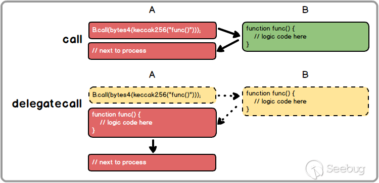

## 0x00 Info

本篇为DASP TOP10的第二类漏洞[Access Control](https://www.dasp.co/#item-2)。通过Parity及Rubixi合约分析理解此类型漏洞，改写OpenZeppelin中题目辅助理解。

<!-- more -->

## 0x01 Access Control

**概念**：攻击者通过合约不安全的**可见性**设置时可以直接访问合约的私有变量和函数，这其中需要可能需要绕过一些访问控制。

> 在使用 Solidity 编写合约代码时，有几种默认的变量或函数访问域关键字：private, public, external 和 internal，对合约实例方法来讲，默认可见状态为 public，而合约实例变量的默认可见状态为 private。
> 具体讲解参见[solidity develop visibility](https://solidity.readthedocs.io/en/develop/contracts.html?highlight=private#visibility-and-getters)
> 这里需要重点关注下external和internal，external函数为合约接口，只能被其他合约调用（在自身需通过this.f()调用）。而internal函数只能被自身调用。

此类漏洞经常会发生在以下场景：
* 合约使用已经遗弃的tx.origin验证调用者
* 通过很长的require处理大量的认证逻辑
* 通过delegatecall调用代理库或者代理合约

通俗讲就是一般的智能合约会通过初始化指定合约的拥有者，来实现类似赋予特权后收回合约资金的功能。而初始化函数如果能被任何人调用的话，攻击者就会将自己成为合约拥有者进行提币或恶意操作。

这里最著名的漏洞就是Parity Wallet Hack。但在介绍该漏洞前需要理解一些solidity知识。

## 0x02 tx.origin

[Solidity: Tx Origin Attacks](https://medium.com/coinmonks/solidity-tx-origin-attacks-58211ad95514)

在solidity官方文档中已经声明[禁止使用tx.origin做认证](http://solidity.readthedocs.io/en/develop/security-considerations.html#tx-origin)。

> If your wallet had checked msg.sender for authorization, it would get the address of the attack wallet, instead of the owner address. But by checking tx.origin, it gets the original address that kicked off the transaction, which is still the owner address. The attack wallet instantly drains all your funds.

在solidity中获取合约调用方地址有tx.origin和msg.sender两种方式，但msg.sender代表直接调用者的地址，而tx.origin代表源调用地址。

举例：
用户A通过合约B调用合约C
对于合约B，tx.origin和msg.sender均为A
对于合约C，tx.origin为A，msg.sender为B

## 0x03 call & delegatecall

向合约发送消息有两种底层调用的接口，一个是call，一个是delegatecall。
call的原型为：
`<address>.call.value(...)(...) returns (bool)`
delegatecall原型为：
`<address>.delegatecall(...) returns (bool)`
具体的使用可以看[call相关函数](http://me.tryblockchain.org/Solidity-call-callcode-delegatecall.html)

这里有两点需要特别强调
1. 二者的异同：

| 相同 | 不同 |
| :--- | :--- |
| 1. 调用时传递合约所有gas | 1. call可以使用.value传ETH |
| 2. 执行失败返回fasle | 2. call的外部调用上下文是外部合约，而delegatecall的外部调用上下文是自身 |

这里借图说话：


实例（可在[remix](https://remix.ethereum.org)操作）：
```js
contract A {
    event callMeMaybeEvent(address _from);
    function callMeMaybe() payable public {
        callMeMaybeEvent(this);
    }
}

contract B {
    function callTheOtherContract(address _contractAddress) public {
        require(_contractAddress.call(bytes4(keccak256("callMeMaybe()"))));
        require(_contractAddress.delegatecall(bytes4(keccak256("callMeMaybe()"))));
        SomeLib.calledSomeLibFun();
    }
}

library SomeLib {
    event calledSomeLib(address _from);
    function calledSomeLibFun() public {
        calledSomeLib(this);
    }
}
```

2. 向另一个合约发送数据时，找不到对应的方法签名，会默认调用fallback()函数。而solidity中的代理库和代理合约正是依据此特性。具体可以看看[Proxy Libraries in Solidity](https://blog.zeppelin.solutions/proxy-libraries-in-solidity-79fbe4b970fd)。Parity正是依照代理库模式开发，该模式可以解决大量代码的重复部署问题，同时能够减少重复部署产生的gas消耗，最重要可以实现更新只需更新库而不用重新更新部署每个项目。

有了上述的知识储备后进入正题，现实合约中的访问控制漏洞。

## 

## 0x04 Parity 

首先建议阅读一些分析文章，然后说说自己的理解
推荐zeppelin（区块链安全公司）的分析：
* [The Parity Wallet Hack Explained](https://blog.zeppelin.solutions/on-the-parity-wallet-multisig-hack-405a8c12e8f7)

中文分析：
* [Parity多重签名函数库自杀漏洞](http://www.freebuf.com/vuls/177805.html)
* [Parity多重签名合约Delegatecall漏洞回顾](http://www.freebuf.com/vuls/177886.html)

Code:
* [WalletLibrary](https://etherscan.io/address/0x863df6bfa4469f3ead0be8f9f2aae51c91a907b4#code)
* [enhanced-wallet.sol
](https://github.com/paritytech/parity-ethereum/blob/4d08e7b0aec46443bf26547b17d10cb302672835/js/src/contracts/snippets/enhanced-wallet.sol#L424)

大体浏览钱包合约代码，其中有四个合约模块：
```js
WalletEvents  // 事件合约，打印日志
WalletAbi    // 提供abi接口
WalletLibrary   // 代理库，继承WalletEvents。钱包的核心逻辑，漏洞点正是该合约的initWallet -> initMultiowned函数
Wallet  // 钱包合约，可以看到代码量很小，通过fallback函数的delegatecall函数调用WalletLibrary函数
```

可以看到Parity使用了代理库模式。在使用Wallet逻辑时，是间接通过传递参数调用WalletLibrary中函数
`_walletLibrary.delegatecall(msg.data);`
而WalletLibrary库中initWallet -> initMultiowned函数又没有做任何校验即可改变合约的拥有者，故而形成漏洞。

## 0x05 Rubixi

Rubixi合约中的访问控制漏洞 [Code](https://etherscan.io/address/0xe82719202e5965Cf5D9B6673B7503a3b92DE20be#code)
可以直接copy进remix进行测试。将creator变量修改为public，通过DynamicPyramid函数即可恶意修改creator。

## 0x06 ethernaut

在OpenZeppelin的[ethernaut](https://github.com/OpenZeppelin/ethernaut)中有道[Delegation](https://github.com/OpenZeppelin/ethernaut/blob/master/contracts/levels/Delegation.sol)题目，正好是此漏洞类型。
修改下合约名和函数名便于对比Parity漏洞进行理解：
```js
contract WalletLibaray {
    address public owner;

    function WalletLibaray(address _owner) {
        owner = _owner;
    }
    function initWallet() {
        owner = msg.sender;
    }
}

contract Wallet {
    address public owner;
    WalletLibaray _walletLib;

    function Wallet(address _walletLibAddress) {
        _walletLib = WalletLibaray(_walletLibAddress);
        owner = msg.sender;
    }
    function () {
        if (_walletLib.delegatecall(msg.data)) {
            this;
        }
    }
}
```
Wallet合约中构造函数实例化WalletLibaray。
通过fallback函数中delegatecall传参调用WalletLibaray库函数，调用无任何访问控制的initWallet函数即可改变owner。

## 0x07 Fomo3D

参见[#DASP# Bad Randomness (6) -- Fomo3D](https://houugen.fun/2018/08/09/DASP-Bad-Randomness-6/#more)
