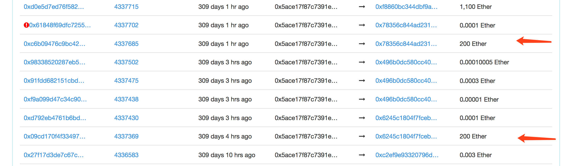
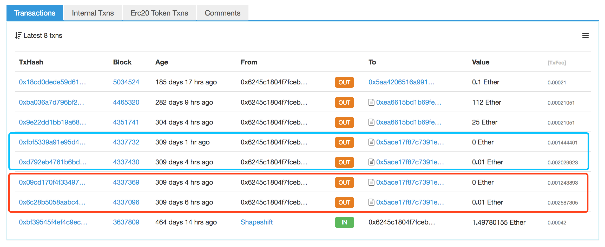
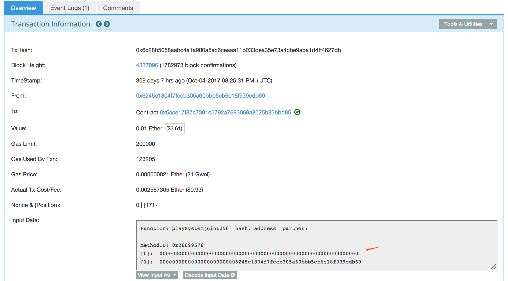
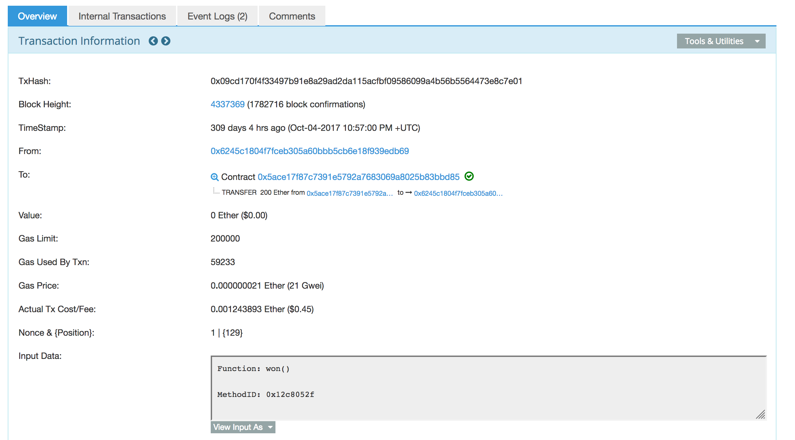
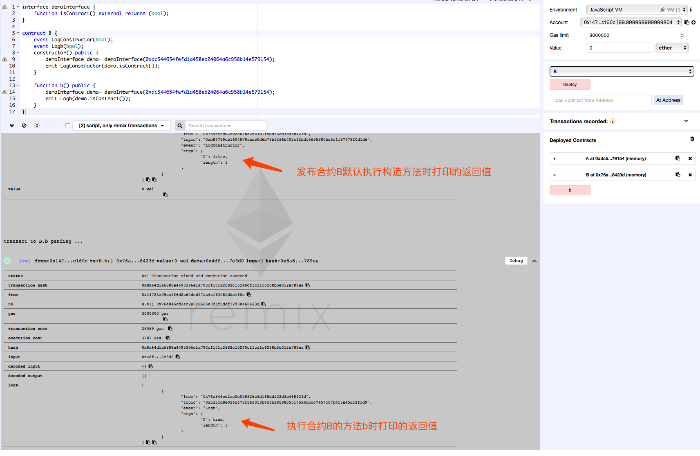

## 0x00 Info

绝对的随机在Ethereum中很难实现，因为所有参数都可以在透明的链上查询，因此想要利用随机特性生成逻辑很容易出现bug，本篇就介绍DASP中第六类漏洞--[不安全的随机性](https://www.dasp.co/#item-6)。

<!-- more -->

## 0x01 错误实践

Solidity本身提供一些获取“随机值”的方法和变量，你可以在[官方文档](http://solidity.readthedocs.io/en/v0.4.21/units-and-global-variables.html)中查看。但是这些“随机值”（在链上公开）如果不当的作为生成随机数的因子或种子，那随机数就可以被预测。

根据DASP提供的实例我们看看有哪些坑。

**第一种**
```js
uint256 private seed;

function play() public payable {
    require(msg.value >= 1 ether);
    iteration++;
    uint randomNumber = uint(keccak256(seed + iteration));
    if (randomNumber % 2 == 0) {
        msg.sender.transfer(this.balance);
    }
}
```
利用私有变量seed和iteration通过keccak256 hash计算得到随机数，虽然seed属性为private，但是它也要在某个时间点设置，可以通过链上相关tx来获取其值，因此随机性可预测。

**第二种**
```js
function play() public payable {
    require(msg.value >= 1 ether);
    if (block.blockhash(blockNumber) % 2 == 0) {
        msg.sender.transfer(this.balance);
    }
}
```
这里使用`block.blockhash(blockNumber)`来计算随机数，这里必须强调的是，在solidity中，`block.blockhash(uint blockNumber) returns (bytes32)`只计算就近的256个块hash，如果blockNumber为当前块（block.number）或者超过256更久远的块，计算结果都是0.
> block.blockhash(uint blockNumber) returns (bytes32): hash of the given block - only works for 256 most recent blocks excluding current

> The block hashes are not available for all blocks for scalability reasons. You can only access the hashes of the most recent 256 blocks, all other values will be zero.

同时Solidity文档也强调尽量不要使用`block.timestamp`、`now`和`block.blockhash`计算随机数。
> Do not rely on block.timestamp, now and block.blockhash as a source of randomness, unless you know what you are doing.
>
>Both the timestamp and the block hash can be influenced by miners to some degree. Bad actors in the mining community can for example run a casino payout function on a chosen hash and just retry a different hash if they did not receive any money.

* `block.timestamp (uint)`: current block timestamp as seconds since unix epoch
* `now (uint)`: current block timestamp (alias for `block.timestamp`)
* `block.blockhash(uint blockNumber) returns (bytes32)`: hash of the given block - only works for 256 most recent blocks excluding current

## 0x02 案例

我们先来看两个DASP提供的真实案例。

### SmartBillions

披露：[SmartBillions lottery contract just got hacked!](https://www.reddit.com/r/ethereum/comments/74d3dc/smartbillions_lottery_contract_just_got_hacked/)

[SmartBillions](https://smartbillions.com)是一个赌博合约（[Contract Source Code](https://etherscan.io/address/0x5ace17f87c7391e5792a7683069a8025b83bbd85)），本身是一个ICO项目。玩法是下注6位数，每位范围0-15，猜中2位以上会获得相应奖励。根据论坛作者supr3m的披露，该合约本身存在随机数漏洞，黑客利用触发2次漏洞取走合约中400ETH，在后续要利用漏洞全部取走资金时，ICO利用后门函数冻结资金防止资金被盗。这个后门函数也被作者吐槽，怀疑ICO会利用后门集资卷款跑路。

我们先看下黑客利用合约漏洞做的tx
1. 合约执行标签可以看到两笔200ETH的操作

2. 在4337369块，合约0x5ace17f87c7391e5792a7683069a8025b83bbd85向0x6245c1804F7fCEB305A60BBb5cb6E18F939EDB69账户地址转200ETH，我们看下该地址的TX

3. 黑客首先在4337096块调用合约playSystem(uint _hash, address _partner)函数，第一个参数000001为下注的6位数

4. 然后再超过256块后的4337369块调用合约won()函数，赢得200ETH的二等奖金（猜中前5个下注数）

5. 在第二步的蓝框中黑客还想继续利用同样手法赢得一等奖金（6个下注数全中）

根据论坛作者描述和黑客操作，审计合约后，发现漏洞是在playSystem()中的won()函数中，根据player.blockNum的hash和下注的数字做比对，而这种hash在超过256个块后结果为0，因此黑客押的000001和hash结果000000前5位一致而得到二等奖。

### theRun

[#timestamp dependence bug](https://medium.com/@hrishiolickel/why-smart-contracts-fail-undiscovered-bugs-and-what-we-can-do-about-them-119aa2843007)
[Contract Source Code](https://etherscan.io/address/0xcac337492149bdb66b088bf5914bedfbf78ccc18#code)

合约中利用random(unit Max)函数进行随机数生成，而生成因子主要是利用block.timestamp和block.number，而时间戳可以由矿工操控，故矿工可以选择有利的随机数来提高获取奖励的概率。
```js
function Participate(uint deposit) private {
    
    ...

    // Winning the Pot :) Condition : paying at least 1 people with deposit > 2 ether and having luck !
    if(  ( deposit > 1 ether ) && (deposit > players[Payout_id].payout) ){ 
        uint roll = random(100); //take a random number between 1 & 100
        if( roll % 10 == 0 ){ //if lucky : Chances : 1 out of 10 ! 
            msg.sender.send(WinningPot); // Bravo !
            WinningPot=0;
        }    
    }
    
    ...
}

uint256 constant private salt =  block.timestamp;

function random(uint Max) constant private returns (uint256 result){
    //get the best seed for randomness
    uint256 x = salt * 100 / Max;
    uint256 y = salt * block.number / (salt % 5) ;
    uint256 seed = block.number/3 + (salt % 300) + Last_Payout +y; 
    uint256 h = uint256(block.blockhash(seed)); 

    return uint256((h / x)) % Max + 1; //random number between 1 and Max
}
```

接着我们研究下受随机数漏洞影响的当下最火游戏合约Fomo3D。

### Fomo3D

> 这是一个叫JUST的团队开发的以太坊游戏，just在英文中有“公正、正义”的意思，然而游戏从UI界面到游戏说明充满了恶搞和对人性贪婪的讽刺，比如推荐链接在游戏中就叫“坏建议”，开发团队并不避讳这是一个乐透game，声称这是一次大型社会学实验。

**这个游戏本身就是一个庞氏骗局，各位看官三思而后入！**

[游戏官网](https://exitscam.me/)
[游戏玩法介绍](https://zhuanlan.zhihu.com/p/40306713)
[FoMo3Dlong Source Code](https://etherscan.io/address/0xa62142888aba8370742be823c1782d17a0389da1#code)

而漏洞发现的起因也非常有趣，Fomo3D游戏的开发者在twitter上@V神，说发现一个EVM上核弹级漏洞，结果被Ethereum团队leader回怼，并且顺手找了一个Fomo3D游戏漏洞^_^
故事经过在文章[Pwning Fomo3D Revealed: Iterative, Pre-Calculated Contract Creation For Airdrop Prizes!](https://www.peckshield.com/2018/07/24/fomo3d/)中有介绍，并且描述了Fomo3D漏洞。

根据文章描述Fomo3D存在两个漏洞导致被薅羊毛。

**第一个漏洞--错误的访问控制检查：**
```js
modifier isHuman() {
    address _addr = msg.sender;
    uint256 _codeLength;
    
    assembly {_codeLength := extcodesize(_addr)}
    require(_codeLength == 0, "sorry humans only");
    _;
}
```
FoMo3Dlong合约使用isHuman()函数判断调用者是一个外部账户还是一个合约地址，核心利用`assembly {_codeLength := extcodesize(_addr)}`判断，其中关键函数`extcodesize(a)`代表a地址上的代码大小，如果等于0，则代表一个外部账户，非0则代表合约地址，本身很好理解。
但这样判断有个风险，在[Mechanism Design Security in Smart Contracts](https://medium.com/@matthewdif/mechanism-design-security-in-smart-contracts-87f08555b38b)一文中提到：
> NOTE: Do not use the EXTCODESIZE check to prevent smart contracts from calling a function. This is not foolproof, it can be subverted by a constructor call, due to the fact that while the constructor is running, EXTCODESIZE for that address returns 0.

例：合约A中有函数funA使用如上的访问控制，当你在一个合约B的构造函数（constructor()）中调用合约A中的funA，可绕过访问控制成功调用，尽管B是一个合约。extcodesize(B_addr) return 0.

我们可以通过remix验证这一点：
合约A，主要功能是判断调用者是外部账户(返回false)还是合约账户(返回true)：
```js
contract A {
    function isContract() public returns (bool isContract){
      uint32 size;
      address _addr = msg.sender;
      assembly {
        size := extcodesize(_addr)
      }
      return (size > 0);
    }
}
```

发布合约A并将合约A地址写入合约B，合约B分别在构造函数内外去调用合约A的isContract()函数，通过log查看返回值：
```js
interface demoInterface {
    function isContract() external returns (bool);
}

contract B {
    event LogConstructor(bool);
    event Logb(bool);
    constructor() public {
        demoInterface demo= demoInterface(0xdc544654fefd1a458eb24064a6c958b14e579154);
        emit LogConstructor(demo.isContract());
    }
    
    function b() public {
        demoInterface demo= demoInterface(0xdc544654fefd1a458eb24064a6c958b14e579154);
        emit Logb(demo.isContract());
    }
}
```

发布合约B并且调用方法b，对比下log中打印的返回值

可以看到在构造函数中调用其他合约受控（extcodesize()）的方法可以绕过访问控制。

**第二个漏洞--可预测的随机数：**
Fomo3D中你在花钱买key的时候会有一定几率获得空投。
```js
function airdrop()
        private 
        view 
        returns(bool)
{
    uint256 seed = uint256(keccak256(abi.encodePacked(
        
        (block.timestamp).add
        (block.difficulty).add
        ((uint256(keccak256(abi.encodePacked(block.coinbase)))) / (now)).add
        (block.gaslimit).add
        ((uint256(keccak256(abi.encodePacked(msg.sender)))) / (now)).add
        (block.number)
        
    )));
    if((seed - ((seed / 1000) * 1000)) < airDropTracker_)
        return(true);
    else
        return(false);
}
```
可以看到随机数种子seed的计算是由当前块的信息加上msg.sender构成，而攻击者可以在合适的时间计算得到小于airDropTracker_的seed，从而保证100%获取空投奖励。

文章描述攻击步骤可以总结为：
> 
    1. Pre-calculate the address X of the next contract that the attacker address is about to create;
    2. If X can’t be used to generate a good seed with the current airDropTracker_, goto step 1;
    3. Create contract at address X;
    4. Invoke buyXid() function from X to win the airdrop prize;
    5. Invoke withdraw() function from X to get earnings calculated by the airdrop prize;

> 这里还有个知识点是[如何计算以太坊合约地址](https://ethereum.stackexchange.com/questions/760/how-is-the-address-of-an-ethereum-contract-computed)，读者可以去主动学习。

[How to PWN FoMo3D, a beginners guide](https://www.reddit.com/r/ethereum/comments/916xni/how_to_pwn_fomo3d_a_beginners_guide/) 同样提供了漏洞分析及exp利用。

## 0x03 最佳实践

在[Predicting Random Numbers in Ethereum Smart Contracts](https://blog.positive.com/predicting-random-numbers-in-ethereum-smart-contracts-e5358c6b8620)一文中，调研3k+合约发现43个合约存在随机数可被预测的问题，其主要由4类漏洞产生：
* PRNGs using block variables as a source of entropy
* PRNGs based on a blockhash of some past block
* PRNGs based on a blockhash of a past block combined with a seed deemed private
* PRNGs prone to front-running（后续文章会讲到）

同时也描述了如何实现更安全随机数的3中方法：
* External oracles
* Signidice
* Commit–reveal approach
