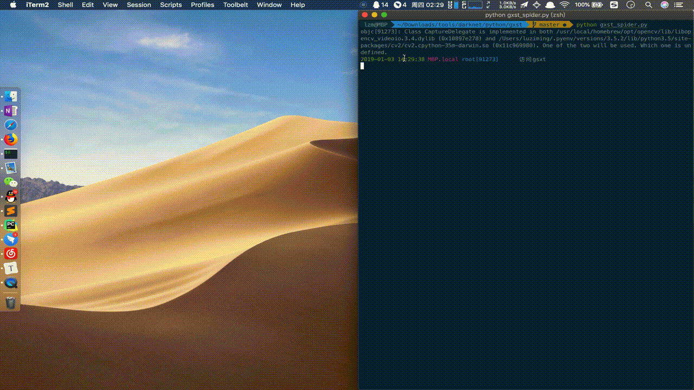

## 背景

[国家企业信用信息公示系统](http://www.gsxt.gov.cn/index.html)查询时使用极验验证码，大概率为第三代汉字语序点选识别。


查询资料发现可使用深度学习进行汉字定位及分类。

**参考资料**：

* [https://runninggump.github.io/2018/11/19/破解含语序问题的点击验证码](https://runninggump.github.io/2018/11/19/破解含语序问题的点击验证码)
* [https://cos120.github.io/crack/](https://cos120.github.io/crack/)
* [https://www.cnblogs.com/codefish/p/10104320.html](https://www.cnblogs.com/codefish/p/10104320.html)
* [http://www.aneasystone.com/archives/2018/03/python-selenium-geetest-crack.html](http://www.aneasystone.com/archives/2018/03/python-selenium-geetest-crack.html)

实践后效果：



使用的框架、算法及工具：

* 定位&分类
  * 样本标注：[labelImg](https://github.com/tzutalin/labelImg)、[若快](http://www.ruokuai.com/)
  * 训练框架：[darknet yolov3](https://pjreddie.com/darknet/yolo/)
* 语序识别
  * [百度ocr](https://cloud.baidu.com/doc/OCR/OCR-API.html#.E6.8E.A5.E5.8F.A3.E8.83.BD.E5.8A.9B)
  * [结巴分词](https://github.com/fxsjy/jieba)
  * 百度搜索词频统计
* 模拟
  * [selenium](https://selenium-python.readthedocs.io/)
  * 滑动轨迹：利用[jquery.easing](https://easings.net/zh-cn)模拟人工轨迹

## 踩坑

汉字定位和分类学习详尽的实践步骤参考资料中都有说明，这里不再叙述。这里记录下实践过程中踩的坑及一些特殊处理。

### darknet环境

1. **坑1**：不要使用cpu训练
2. windows/linux推荐使用 [AlexeyAB/darknet](https://github.com/AlexeyAB/darknet)，专门定制。
   * VS2017 + VC++2015 v140工具集
   * [CUDA9.0](https://developer.nvidia.com/cuda-90-download-archive) （**坑2：** 10.0 在win10 nvidia gtx 1080 ti上报 `cuda error:no error`，==！答案搜都搜不到，耽搁许久尝试降级才成功）
   * [OpenCV 3.4.0](https://opencv.org/releases.html)
   * [cuDNN7.1](https://developer.nvidia.com/rdp/form/cudnn-download-survey)

### 分类样本

3. **坑3**：使用手工标注汉字分类样本500张1h后发现刚不住，可使用打码平台，多进程8w张3h搞定。

4. **坑4**：分离1.3k汉字训练后验证100张发现准确率同样为85%！无需更多样本分离更多汉字。

5. **坑5**：人工打码准确率不能奢望，又花费1h对词频小于10的茫茫多汉字进行修正（脚本在仓库）。

### yolo训练

6. **坑6**：过拟合！loss稳定即可结束，否则过拟合造成结果失真。

### 语序识别

7. 发现验证码图片底部会有正确语序

   

   **坑7**：但多跑几个验证码发现底部汉字会有残缺情况，导致ocr识别少字或错字，增加ocr进行语序识别需修改[破解含语序问题的点击验证码](https://runninggump.github.io/2018/11/19/破解含语序问题的点击验证码)中语序识别算法。100张准确率可提升至90%，识别速度大幅降低。

### 模拟点击

8. **坑8**：使用selenium的ActionChains进行模拟点击发现正确点选确定后验证失败，应该是极验进行了轨道判断，需要模拟人工滑动轨迹后点击。从100%失败的直接点击到30%成功的折线轨迹最后进化到99%成功easing轨迹。

## 重要目录说明

```t
darknet
	jiyan # 定位
	jiyan_classify # 分类
	python # 破解
		gxst # 爬虫
	cfg # 配置文件
	weights # 权重
```